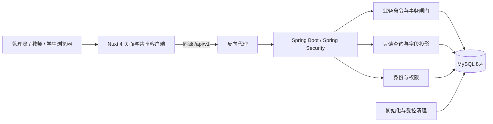
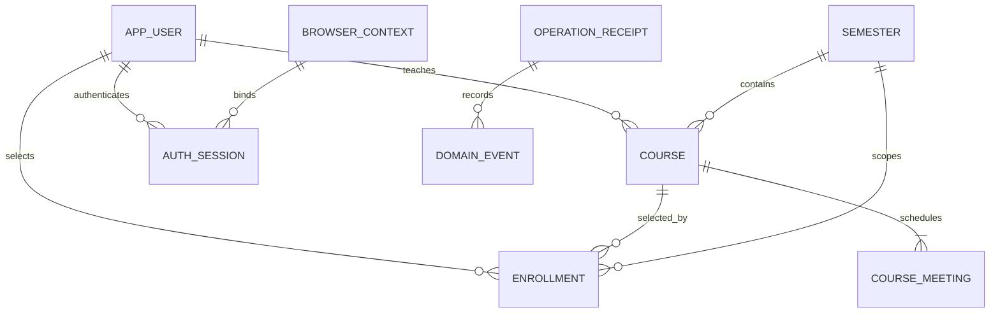
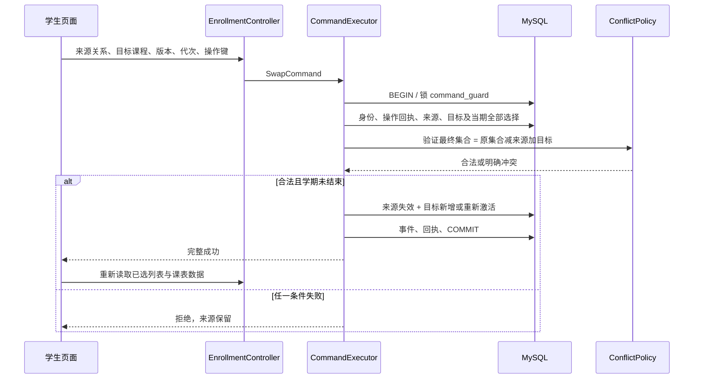

# 选课系统技术设计书

> 2026-09-06 环境执行更新：已按用户要求安装开发工具、WSL 和 Docker Desktop，Windows 虚拟机平台等待重启生效。当前安装及验证事实以 [P-02 环境记录](docs/verification/P-02.md) 为准；下文 2026-09-04 的本机版本和“未安装”描述保留为历史记录，不代表本次状态。业务技术契约版本不变，P-02 尚未全部完成。

> 版本：1.0.6  
> 日期：2026-09-04  
> 状态：技术设计提案，可用于实现评审；业务规则沿用已确认的正式需求  
> 依据：[requirement.md](requirement.md) v1.0.6、[development-plan.md](development-plan.md) v1.0.6  
> 交付：本地 design.md，并按用户逐项确认同步需求与计划；不创建业务工程、不执行迁移或部署。  
> 完成程度：已定义模块、数据、接口和流程并完成文档自查；依赖安装、编译、数据库集成及性能验证尚未执行，不能据此将 P-02、P-03 或业务任务标为全部完成。

## 1. 设计摘要

系统服务于受控演示环境：管理员维护师生账号；教师按固定学期管理课程并查询学生；学生在每学期四门且无时间冲突的条件下选课、退课和换课。设计采用 Nuxt 客户端界面、Spring Boot 模块化单体和 MySQL，所有角色共用同一套身份、权限、学期及事务规则。

核心选择是通过数据库中的单个业务写入闸门串行化关键变更。选课、换课、改课程时间、删除课程和删除账号都会改变互相关联的状态，首版优先让这些操作形成可验证的先后顺序。代价是业务写吞吐受单个短事务限制；在目标为 50 名并发活跃用户的系统中先按第 10 节实测，不提前拆分微服务或引入消息队列。

数据使用不可变内部标识关联，师生账号和课程编号仅作业务展示。课程绑定学期；当前有效选课与历史事件分离。所有成功变更在同一事务中保存业务数据、去重结果和操作记录，查询页面通过明确的字段投影读取最新状态。

## 2. 范围、现状与技术基线

### 2.1 当前仓库与边界

当前仓库包含需求、任务计划、技术设计、独立交互设计、SDD 说明和空的 AGENTS.md，尚无业务实现、数据库迁移或构建工程。下文给出的包名、路由、表名及类名是拟实现契约，不能被当作现有代码。

三类角色、注册字段、admin 初始密码、84 天学期、课程状态、退换课和教师全体学生查询均按 requirement.md 执行。不增加管理员代选、真实身份审核、容量、候补、课程跨学期迁移或真实日期月历。

本文作为唯一技术契约，集中承载 P-02 的技术主体、接口和验证方案，不再维护原计划中重复的 docs/design 技术拆分稿。用户已选择独立 [interaction-design.md](interaction-design.md)，其第 4、6、7 节定义页面、32 个接口的使用位置和失败恢复；正文与本设计同版。P-03 文档和静态走查已交付，视觉样张核验仍未完成；P-02 环境及实际兼容验证仍需补齐。运行证据保存至 docs/verification/P-02.md、P-03.md，不把契约文档当作执行结果。

### 2.2 已核对的信息与运行选择

| 项目 | 需求约束 | 本设计选择及证据 |
| --- | --- | --- |
| Nuxt | 4.5.2 | 固定 4.5.2；官方发布标签存在；该标签包元数据要求 Node.js ^22.19.0、^24.11.0 或 >=26.0.0 |
| Node.js | 20.19+ | 采用本机已验证存在的 24.20.0，满足 Nuxt 和 pnpm 约束；不能按原下限安装 Node.js 20 |
| pnpm | 11 | 固定本机已读到的 11.19.0；官方 pnpm 11 文档要求 Node.js 22+ |
| Vue / TypeScript | Vue 3 / TypeScript | Vue 3 使用 Nuxt 4.5.2 的兼容依赖，TypeScript 使用 Nuxt 支持的版本；首次解析写入精确 lockfile，不单独强行升级 |
| Spring Boot | 4.1.1 | 固定 4.1.1，MVC + Data JPA；其官方系统要求 Java 17+、Maven 3.6.3+ |
| Java | 17+ | 用户已确认选项 A：统一采用 Java 21 LTS，编译 release=21；开发、测试和部署均使用 JDK 21，P-02 固定发行版及精确补丁；本机当前 Java 17.0.1 尚待安装切换 |
| Maven | 3.9.16 | 固定 3.9.16，本次复核本机已为 3.9.16，版本达标；当前仍运行于 Java 17.0.1，切换后须核对 mvn --version 的运行时为 JDK 21 |
| MySQL | MySQL | 用户已确认选项 A：采用 8.4 LTS、InnoDB，新建独立开发实例，保留本机 8.0.27 及数据；P-02 固定补丁号及发行包或容器摘要，独立开发和测试实例使用同一版本 |
| 其他后端库 | 未指定 | Spring Security、Validation、Actuator、Flyway、MySQL Connector/J；优先使用 Boot BOM 管理版本 |
| 验证工具 | 既定检查命令 | JUnit + Testcontainers MySQL；Vitest；Playwright；k6，由项目脚本调用 |
| 本地容器运行环境 | 用户已确认 Docker 选项 A | Docker Desktop + WSL 2 后端，Linux 容器；P-02 核验系统条件后安装并固定精确版本；Docker Compose 管理独立开发 MySQL，Testcontainers 管理临时集成测试实例 |

证据：[Nuxt 4.5.2 发布](https://github.com/nuxt/nuxt/releases/tag/v4.5.2)、[对应包的 Node.js engines](https://raw.githubusercontent.com/nuxt/nuxt/v4.5.2/packages/nuxt/package.json)、[pnpm 安装要求](https://pnpm.io/installation)、[Spring Boot 系统要求](https://docs.spring.io/spring-boot/system-requirements.html)、[Maven 发布历史](https://maven.apache.org/docs/history.html)。

这些证据证明版本发布及声明的兼容范围，不等于本项目已经完成依赖解析和集成运行。本机 Node、Java、Maven、pnpm 已做只读版本检查；未在 PATH 中发现 Docker 命令。第 12 节列出需要补齐的环境证据。

## 3. 系统上下文



前端使用 Nuxt 的客户端渲染模式 ssr=false，通过 Vue 页面完成表单和状态管理。该系统不需要搜索引擎收录，因此不在 Nuxt 服务端重复做鉴权或业务转发。部署时静态资源和 /api/v1 由同一站点提供；开发时 Nuxt 代理 /api/v1 到 Spring Boot，避免开发与部署采用不同跨域权限模型。

反向代理负责 TLS、请求体限制及路由；Spring Boot 是唯一业务权限和规则执行点；MySQL 是身份、业务、去重及历史结果的持久化来源。没有外部身份提供方、邮件服务、消息队列或缓存服务。

## 4. 模块划分与职责

### 4.1 后端模块

采用单 Maven 应用，根包 com.curriculum。按业务模块组织包，在模块内区分 api、application、domain、infrastructure。Controller 只解析请求和映射响应；应用服务组织流程；领域规则计算合法性；Repository 负责持久化，不在 Controller 或实体生命周期回调中开启独立业务事务。

| 模块 | 主要服务 / 职责 | 依赖与禁止事项 |
| --- | --- | --- |
| identity | AuthService、SessionService、AccountPolicy：注册、登录、会话、角色及密码校验 | 依赖用户与会话存储；不负责选课或课程归属变更 |
| account | AccountCommandService、AccountQueryService：管理员师生资料维护、删除影响编排 | 调用 enrollment 的取消和 course 的删除前检查；不直接复写其业务规则 |
| semester | SemesterService、SemesterPolicy：学年生成、区间计算、当前学期和结束判断 | 依赖学校时区和数据库时间；不维护一份可随意改日期的日历 |
| course | CourseCommandService、SchedulePolicy：课程创建编辑上下架删除 | 读取有效选课判断可编辑性；不替学生退课 |
| enrollment | EnrollmentCommandService、ConflictPolicy：选课、退课、原子换课、账号删除时取消当前选课 | 使用课程及学期规则；不能独立改变课程安排 |
| query | TeacherCourseQuery、CatalogQuery、MySelectionQuery、RosterQuery、StudentOverviewQuery、TimetableQuery | 允许跨表只读投影；不把实体对象直接序列化，不写业务表 |
| command | CommandExecutor、OperationService：统一事务、全局写闸门、重放、版本校验框架和审计 | 负责执行顺序；不能内置“最多四门”等业务规则 |
| platform | ApiErrorHandler、DatabaseTimeProvider、RateLimiter、Health、Bootstrap | 提供时间、错误、限流、配置、迁移和初始化；不能绕过业务闸门写业务表 |

跨模块调用通过应用服务或只读查询接口；禁止互相依赖 Controller。所有业务写入口由 CommandExecutor 打开最外层事务，内部应用服务加入同一事务，不使用 REQUIRES_NEW 保存半套业务结果。

### 4.2 前端模块与路由

| 模块 | 主要路由 | 共享能力 |
| --- | --- | --- |
| 公共身份 | /login、/register | useAuth、useApi、useOperation、字段错误与会话恢复 |
| 管理员 | /admin/accounts、/admin/accounts/new、/admin/accounts/[id] | 角色筛选、资料编辑、密码重置、删除确认 |
| 教师课程 | /teacher/courses、/teacher/courses/new、/teacher/courses/[id]、/teacher/timetable | useSemester、课程表单、状态按钮、周课表 |
| 教师学生查询 | /teacher/courses/[id]/students、/teacher/students | 名单分页、学期选择、完整选课清单 |
| 学生 | /student/catalog、/student/courses、/student/timetable | 选课、退课确认、换课对话框、已选计数 |

使用 Nuxt useState 保存当前身份及当前学期，组件内保存表单；不额外引入全局状态库。服务端数据缓存键必须包含 userId、role、semesterId、筛选和页码。退出登录清空所有用户缓存。切换学期取消旧请求，并通过请求代次校验防止慢响应覆盖新学期。

前端只根据服务器返回的 allowedActions 展示按钮，仍必须在后端重新检查。所有删除和退换课确认展示对象、学期和影响，不在前端直接拼接两次写请求实现换课。

交互实现契约详见 interaction-design.md 第 6～7 节：写请求客户端等待上限 10 秒，超时仅停止本地等待，转结果待确认；先自动查询一次 API-07/08，再由用户主动查询或原键原内容重试，不持续轮询。404 操作未找到不等于请求永远不会提交；成功回执后重新读取现状，不能覆盖后续变化。

待确认元数据只在当前标签页 sessionStorage 保存最多 20 条：操作键、类型、目标内部标识、学期、所属用户标识及创建时间，不保存 Cookie、密码、请求正文或个人资料快照。达到上限要求先确认旧结果，不能静默丢弃未知操作。恢复后先验证身份；成功、明确拒绝或到期并确认现状后移除；退出及换账号清理。非密码草稿仅内存保留，401 后仅同一身份重新登录并读取最新版本后可手动恢复，不能自动重提。页面状态、查询键和待确认元数据均不能替代服务端授权。

### 4.3 关键架构决策

1. **统一短事务而非异步补偿**：数据库事务直接保证换入换出完整性；不通过先退后选、后台补单或异步更新人数实现核心规则。
2. **全局业务写闸门**：为首版规模减少多对象锁顺序和空集合幻读问题。代价是写入串行，需要明确超时、资源限制和负载证明，见第 7、10 节。
3. **会话存在数据库，角色随请求查验**：避免删除账号或重置密码后长效令牌仍可用；代价是每次受保护请求至少一次身份查询。
4. **有效选择只保留当前关系，历史用事件记录**：退后重选增加关系代次，旧请求不能修改新选择；避免通过删除历史记录解决唯一性。
5. **列表、人数和课表直接投影业务数据**：不另存易漂移的选课总数字段，不使用前端分页数据生成完整课表。
6. **逻辑删除保留唯一值**：不复用历史账号、编号和邮箱，简化身份历史；误删恢复不在首版范围内。

## 5. 不变量与需求落实

不重新编号或重述另一套业务规格，下表直接引用正式需求。

| 不变量 | 落实位置 |
| --- | --- |
| INV-01 | app_user 唯一约束、账号前缀检查、admin 特例；identity/account |
| INV-02 | SecurityFilterChain 角色检查、每个服务的归属校验、独立 DTO |
| INV-03、INV-04 | SchedulePolicy + meeting 唯一/检查约束；整门课程一次事务写入 |
| INV-05、INV-06 | 全局写闸门内读取完整当期选课，ConflictPolicy 检查最终集合 |
| INV-07 | enrollment 唯一学生课程组合、generation 代次、operation_receipt 墓碑 |
| INV-08 | CommandExecutor 单事务，数据、事件、操作结果一起提交 |
| INV-09 | 同一读事务快照、明确学期过滤、按授权字段投影 |
| INV-10 | 密码散列、Cookie 保护、请求摘要加密密钥、日志字段白名单 |
| INV-11、INV-12 | 课程学期不可变，结束状态由数据库时间推导，最终写入前复核 |
| INV-13、INV-14 | 已上架检查与编辑/删除条件都在同一写闸门内 |
| INV-15 | 用户逻辑删除、auth_version 递增、会话撤销及当前选课取消同一事务 |
| INV-16 | RosterQuery 校验本人课程；StudentOverviewQuery 明确全体学生只读 |

所有错误、超时、重复提交和并发场景也必须执行这些规则。前端提示、后端校验和数据库约束分别负责交互、业务和持久化保护，互不替代。

## 6. 数据结构与接口契约

### 6.1 数据库统一约定

- 数据库 curriculum，InnoDB、utf8mb4；普通文本使用 utf8mb4_0900_as_cs。账号、注册编号、操作键使用 ascii_bin；邮箱先 trim 并使用 Locale.ROOT 转小写，再按二进制唯一值比较。
- 内部数值标识使用正 BIGINT；JSON 中全部作为十进制字符串返回，避免 JavaScript 大整数精度损失。用户输入的名字不是外键。
- 数据表时间为 UTC DATETIME(6)，Java 用 Instant；学期边界用 DATE 和学校时区转换，周安排存当天分钟数，不存会随浏览器时区漂移的时间戳。
- API 字符长度按 Unicode 码点计数，服务端与前端使用同一测试样例；密码保持原值，不 trim。全部 SQL 参数绑定。
- 用户和课程逻辑删除，不使用 ON DELETE CASCADE 清空历史；所有外键 RESTRICT。运行账号无 DROP/ALTER 权限，迁移账号单独配置。
- Flyway 管理 DDL，JPA ddl-auto=validate、open-in-view=false；不依赖 ORM 自动更新表结构。
- 命令事务使用 READ COMMITTED，所有业务写先锁 command_guard；多查询列表使用只读 REPEATABLE READ，QueryGuard 在该事务内再次检查用户和会话，并在同一快照中获取总数、内容、人数及详情。

MySQL 的行锁需要显式事务，检查约束只能承担行内条件，课程安排数量和跨课程冲突仍由事务内业务规则负责。依据：[InnoDB 锁定读取](https://dev.mysql.com/doc/refman/8.4/en/innodb-locking-reads.html)、[CHECK 约束](https://dev.mysql.com/doc/refman/8.4/en/create-table-check-constraints.html)。

### 6.2 业务表

以下字段除明确标注 NULL 外均非空。每张表的字段和约束由首次迁移完整创建，不能只据 ER 图省略唯一键。

| 表 | 字段、类型及默认值 | 索引与约束 |
| --- | --- | --- |
| app_user | id BIGINT AUTO_INCREMENT；account VARCHAR(8)；role VARCHAR(16)；name VARCHAR(50)；registration_number VARCHAR(32) NULL；email_normalized VARCHAR(254) NULL；password_hash VARCHAR(255)；status VARCHAR(16)=ACTIVE；auth_version BIGINT=1；version BIGINT=1；created_at、updated_at DATETIME(6)；deleted_at DATETIME(6) NULL | PK(id)；UQ(account)；UQ(role,registration_number)；UQ(email_normalized)；INDEX(role,status,account)；INDEX(role,status,created_at,id) |
| semester | id BIGINT AUTO_INCREMENT；academic_year SMALLINT；season VARCHAR(8)=AUTUMN/SPRING；starts_on DATE；ends_on_exclusive DATE；created_at DATETIME(6) | PK(id)；UQ(academic_year,season)；UQ(starts_on)；CHECK DATEDIFF(ends_on_exclusive,starts_on)=84；状态由当前时间推导，不存可漂移状态列 |
| course | id BIGINT；code VARCHAR(24)；palette_slot TINYINT；semester_id BIGINT；teacher_id BIGINT；name VARCHAR(100)；description VARCHAR(2000)；publication VARCHAR(16)=DRAFT；version BIGINT=1；created_at、updated_at DATETIME(6)；deleted_at DATETIME(6) NULL | PK(id)；UQ(code)；CHECK(palette_slot BETWEEN 0 AND 11)；UQ(id,semester_id)；FK teacher→user、semester→semester；INDEX(teacher_id,semester_id,deleted_at,created_at,id)；INDEX(semester_id,publication,deleted_at,id) |
| course_meeting | id BIGINT AUTO_INCREMENT；course_id BIGINT；weekday TINYINT；start_minute SMALLINT；end_minute SMALLINT | PK(id)；FK course；UQ(course_id,weekday)；CHECK weekday BETWEEN 1 AND 5；CHECK 起止为 30 的倍数且 start<end；CHECK 整段位于 [480,720] 或 [840,1080] |
| enrollment | id BIGINT AUTO_INCREMENT；student_id BIGINT；course_id BIGINT；semester_id BIGINT；state VARCHAR(20)=ACTIVE；generation BIGINT=1；version BIGINT=1；enrolled_at DATETIME(6)；ended_at DATETIME(6) NULL；updated_at DATETIME(6) | PK(id)；UQ(student_id,course_id)；FK student→user；复合 FK(course_id,semester_id)→course(id,semester_id)；INDEX(student_id,semester_id,state,course_id)；INDEX(course_id,state,student_id) |
| domain_event | id BIGINT AUTO_INCREMENT；operation_id BIGINT；actor_id BIGINT NULL；event_type VARCHAR(40)；entity_type VARCHAR(24)；entity_id BIGINT；semester_id BIGINT NULL；before_data JSON NULL；after_data JSON NULL；occurred_at DATETIME(6) | PK(id)；FK operation→operation_receipt；INDEX(entity_type,entity_id,id)；INDEX(semester_id,id)；审计记录只追加，不经用户接口修改；登录/退出事件以 USER 的数值 id 为实体标识，会话 UUID 只作为受限事件关联信息 |

附加行内约束：

- app_user.role 只能为 ADMIN、TEACHER、STUDENT；ADMIN 必须 account=admin 且注册编号、邮箱为 NULL；TEACHER/STUDENT 必须分别匹配 ^t[0-9]{7}$、^s[0-9]{7}$ 且资料非空；admin name 固定初始为“管理员”。
- app_user.status 只有 ACTIVE、DELETED；DELETED 与 deleted_at 非空保持一致。删除不解除上述唯一键。
- course.publication 只有 DRAFT、PUBLISHED、UNPUBLISHED，分别对应未上架、已上架、已下架；deleted_at 非空代表终止状态，不再新增第四种发布值。
- course_meeting 表内约束不能证明同一课程至少一条且最多两条。CourseCommandService 必须一次读取完整提交并验证，再替换全部安排；不得提供单条安排独立写接口。
- enrollment.state 只有 ACTIVE、DROPPED、SWAPPED_OUT、ACCOUNT_DELETED；ACTIVE 的 ended_at 为 NULL，其余为非空。记录失效后重新选入同一课程时复用该行，generation 和 version 各增加 1，重设 enrolled_at；旧状态、时间与课程安排快照写入 domain_event。
- 已结束学期的 ACTIVE 行表示学期最终有效选课，不再改变。历史名单保留被删除用户的行，日常学生总览过滤 DELETED 用户。
- teacher_id/student_id 对应角色、账号是否可用、结束学期不可变、最多四门和课程有选课不能改时间，都由统一事务验证；不声称单靠 FK 或 CHECK 已证明这些规则。

### 6.3 基础设施表与标识

| 表 | 核心结构 | 用途 |
| --- | --- | --- |
| command_guard | id TINYINT PK，固定 id=1；revision BIGINT=0 | 所有业务命令首先 SELECT ... FOR UPDATE；最终提交判定时 revision+1 |
| number_sequence | name VARCHAR(32) PK；next_value BIGINT；初始 COURSE=1 | 在闸门事务中取值并加一，作为 course.id；code=C+至少三位十进制数，不截断超过三位的编号 |
| browser_context | id CHAR(36) PK；created_at、expires_at DATETIME(6) | 24 小时匿名浏览器上下文，用于注册/登录前的 CSRF 绑定和请求去重 |
| auth_session | id CHAR(36) PK；user_id BIGINT FK；context_id CHAR(36) FK；auth_version BIGINT；issued_at、last_interactive_at、absolute_expires_at DATETIME(6)；revoked_at DATETIME(6) NULL | INDEX(user_id,revoked_at)；保存可立即撤销的服务器会话；绝对期限为 8 小时 |
| operation_receipt | id BIGINT AUTO_INCREMENT PK；scope VARCHAR(80)；operation_key CHAR(36)；method VARCHAR(8)；route VARCHAR(160)；request_digest BINARY(32)；digest_key_version SMALLINT；http_status SMALLINT；outcome VARCHAR(16)；result_data JSON NULL；created_at、expires_at DATETIME(6) | UQ(scope,operation_key)；INDEX(expires_at)；outcome=SUCCEEDED/REJECTED/EXPIRED；结果最长 24 小时保留，过期保留唯一键墓碑 |
| rate_bucket | bucket_type VARCHAR(20)；key_digest BINARY(32)；window_start DATETIME；request_count INT | PK(bucket_type,key_digest,window_start)；定时清理过期窗口；不存原始 IP 或尝试登录账号 |

用户 id、enrollment id 使用数据库自增；会话、匿名上下文和操作键使用 UUID v4。师生 account 的七位数字由 SecureRandom 生成，数字范围 0000000～9999999。持有写闸门后先检查账号是否存在，最多重抽 10 次；唯一索引承担最终保护。达到次数上限返回 ACCOUNT_GENERATION_BUSY，不留下用户记录。邮箱/编号冲突直接拒绝，不改成随机重试。

course.id 从 number_sequence 的 COURSE 行分配，code=C001、C002…C1000。分配失败整个事务回滚，不使用 count+1。course.code 全生命周期不可变，改名和删除不复用标识。用户已确认配色选项 A：固定 12 色调色板，允许复用。课程创建时使用 BIGINT 运算令 n=course.id-1，保存 palette_slot=n mod 12；同一事务完成编号分配、slot 保存、课程插入与回执。palette_slot 创建后不可编辑，不设置颜色唯一约束，不因颜色耗尽拒绝创建。API 的 displayColor=PALETTE_V1[palette_slot]，borderStyle 从 [solid,dashed,double][floor(n/12) mod 3] 派生，不再持久化另一份 display_color。两字段由服务端统一输出，前端直接渲染，避免 JavaScript 大整数舍入和重复分配逻辑。第 13 门课程可以复用第 1 门的颜色而使用另一边框，第 37 门可同时复用颜色和边框，始终通过课程编号、名称明确身份。分配不依赖用户、学期切换、排序、分页或当前选课集合；删除不回收编号、不改变其他课程样式。当前为空库设计，直接使用此表结构，无须为尚未创建的旧颜色列执行迁移；如将来接入已有实现，须先显式映射而不是静默更换存量配色。

固定调色板 PALETTE_V1（按 slot 索引；调色板不可在普通部署中重排或更改）：

| slot | 色系 | 背景色 |
| --- | --- | --- |
| 0 | 珊瑚红 | #F4A3A8 |
| 1 | 橙 | #F6BD60 |
| 2 | 黄 | #F6E27F |
| 3 | 黄绿 | #BDD77D |
| 4 | 绿 | #82C99A |
| 5 | 青绿 | #7BC8BA |
| 6 | 天蓝 | #80CBE5 |
| 7 | 蓝 | #8FADE2 |
| 8 | 紫 | #B3A0DD |
| 9 | 兰紫 | #D29BD4 |
| 10 | 粉 | #E9A6C8 |
| 11 | 棕 | #C3AD94 |

这些色值是首版高区分调色板的设计值，P-03 仍须完成普通视图、灰度及色觉差异模拟下的可读性走查，不把固定色值表当作视觉验收通过。颜色与边框组合可复用，课程编号和名称始终是可读识别信息；不得用颜色或边框编码唯一身份。

operation_receipt 的 scope 为 USER:<userId>、ANON:<contextId> 或 SYSTEM:<jobName>。摘要使用独立密钥的 HMAC-SHA256，输入为方法、包含实际路径标识的规范化路径、排序后的业务查询参数（包括 semesterId）、排序后的业务 JSON、资源版本、来源选课代次；密码仅在计算内存摘要时使用，不保存原请求。确认密码先验证相等，不纳入持久化字段。时间戳、跟踪号和传输头不进入业务摘要。

结果 JSON 只保存返回业务结果所需字段，禁止保存 Cookie、密码和完整用户实体。24 小时后清空 result_data，保留键、摘要和结果类型以防旧请求重新执行；到期请求返回 410 OPERATION_EXPIRED，要求查询当前状态后发起新操作。墓碑和业务事件首版不自动删除，由运维按容量告警评估保留策略，不默默失去重放保护。

### 6.4 关系图



enrollment.semester_id 是受复合外键保护的查询冗余，不是另一个可自由修改的学期来源。人数从 ACTIVE 行 COUNT 得出；全体学生总览先分页查询学生，再批量查询该页学生在所选学期的最多四门课程与安排，避免每个学生单独请求一次。

### 6.5 通用 API 协议

前缀 /api/v1，JSON UTF-8。日期 YYYY-MM-DD，时刻 ISO 8601 UTC，安排使用 weekday=1～5、startTime/endTime=HH:mm。服务端将时分转换为分钟数验证；枚举用英文，中文显示由前端映射。

成功响应：{data,meta:{requestId}}。分页 data={items,page,size,total}，page 从 1 开始、size 默认 20、范围 1～100，非法参数返回 400。元数据可附 operationKey、replayed 和 decidedAt，但不包含凭证。列表默认排序按需求，各接口不开放任意字段拼接排序。

错误响应：{error:{code,message,fieldErrors,details},meta:{requestId}}。fieldErrors 仅包含字段名及提示；details 只能使用该角色有权读取的数据。课程冲突返回课程编号、名称、星期与起止时间。所有角色直接读取实体均不允许。

业务写请求统一带 Idempotency-Key: UUIDv4；修改/删除已有资源带 If-Match: "<version>"，遗漏返回 428 PRECONDITION_REQUIRED。退课额外带 X-Enrollment-Generation，换课请求体带 sourceGeneration。跨学期对象传入不一致时拒绝，不能以客户端给出的 semesterId 重新归属对象。

同一操作键的正确重放先于旧版本检查，返回历史结果并令客户端重新查询当前视图；新键使用旧版本则 409 VERSION_CONFLICT。发生网络超时，不更换键盲目重做。所有受保护响应 Cache-Control: no-store，不将业务 JSON 缓存到公共 CDN。

### 6.6 接口及基本调用链

表中每条链的前后均经过角色/会话/CSRF或参数过滤，以及统一响应映射。Query 表示只读服务，Cmd 表示由 CommandExecutor 管理事务的命令。

| 编号 | HTTP 与路径 | 输入与结果 | 服务调用链 / 所属 Task |
| --- | --- | --- | --- |
| API-01 | GET /auth/context | 创建或复用匿名上下文，设置上下文与 CSRF Cookie；不返回凭证内容到日志 | AuthController → ContextService → browser_context；P-04 |
| API-02 | POST /auth/register | role/name/email/password/confirmPassword；201 返回系统生成的工号／学号（即登录账号），不自动登录 | AuthController → RegistrationPolicy → PasswordEncoder → Cmd(Register) → UserRepository；P-04 |
| API-03 | POST /auth/login | account/password；200 身份与目标路径，Set-Cookie 会话 | AuthController → CredentialCheck → Cmd(Login) → SessionService；P-04 |
| API-04 | POST /auth/logout | 无业务体；200 已退出，清除当前会话 Cookie | AuthController → Cmd(Logout) → SessionService.revoke；P-04 |
| API-05 | GET /auth/me | 当前 userId/account/name/role；401 表示未登录 | AuthController → IdentityQuery；P-04 |
| API-06 | POST /auth/activity | 无业务体；记录真实用户交互心跳，不改变绝对期限 | AuthController → Cmd(Activity) → SessionService.touchInteractive；P-04 |
| API-07 | GET /auth/operations/{key} | 匿名上下文内的注册结果，或登录结果状态；不返回其他上下文结果 | AuthController → OperationQuery(scope=ANON)；P-04 |
| API-08 | GET /operations/{key} | 当前用户操作状态和可读结果，不跨用户 | OperationController → OperationQuery(scope=USER)；所有命令 |
| API-09 | GET /semesters | items 与 defaultSemesterId，按开课日期降序 | SemesterController → ensureAcademicYears → SemesterQuery；P-11 |
| API-10 | GET /admin/accounts | role/q/page/size；仅师生资料分页 | AccountController → AccountQuery；P-12 |
| API-11 | POST /admin/accounts | 与注册相同资料；201 师生账号 | AccountController → PasswordEncoder → Cmd(CreateAccount)；P-12 |
| API-12 | GET /admin/accounts/{id} | 师生资料与 version；不可返回密码 | AccountController → AccountQuery.detail；P-12 |
| API-13 | PATCH /admin/accounts/{id} | name/registrationNumber/email；200 新资料 | AccountController → Cmd(UpdateAccount) → AccountPolicy；P-12 |
| API-14 | POST /admin/accounts/{id}/password-reset | password/confirmPassword；200 新版本；旧会话失效 | AccountController → PasswordEncoder → Cmd(ResetPassword) → SessionService.revokeAll；P-12 |
| API-15 | DELETE /admin/accounts/{id} | If-Match；200 删除结果和取消的当期选课数量 | AccountController → Cmd(DeleteAccount) → CoursePolicy / EnrollmentService → SessionService；P-18 |
| API-16 | GET /teacher/courses | semesterId/page/size；本人未删除课程与人数 | TeacherCourseController → TeacherCourseQuery；P-06 |
| API-17 | POST /teacher/courses | semesterId/name/description/meetings；201 DRAFT 课程；与教师本人同学期课程冲突时 409 TEACHER_TIME_CONFLICT | TeacherCourseController → Cmd(CreateCourse) → SchedulePolicy → CourseRepository；P-05 |
| API-18 | GET /teacher/courses/{id} | semesterId；本人管理详情和 allowedActions | TeacherCourseController → TeacherCourseQuery.detail；P-06 |
| API-19 | PUT /teacher/courses/{id} | semesterId/name/description/meetings，完整替换可编辑内容；200 课程 | TeacherCourseController → Cmd(EditCourse) → SchedulePolicy → EnrollmentQuery；P-14 |
| API-20 | POST /teacher/courses/{id}/publication | semesterId/target=PUBLISHED或UNPUBLISHED；200 课程状态 | TeacherCourseController → Cmd(SetPublication) → CoursePolicy；P-13 |
| API-21 | DELETE /teacher/courses/{id} | semesterId、If-Match；200 已删除结果 | TeacherCourseController → Cmd(DeleteCourse) → EnrollmentQuery.countActive；P-15 |
| API-22 | GET /teacher/courses/{id}/students | semesterId/page/size；本人课程名单、人数和课程头 | RosterController → OwnershipPolicy → RosterQuery；P-19 |
| API-23 | GET /teacher/students | semesterId/q/selection=ALL或SELECTED或NONE/courseId/page/size；courseId 仅可为教师本人课程，学生页及完整课单 | StudentOverviewController → StudentOverviewQuery；P-20 |
| API-24 | GET /teacher/timetable | semesterId；本人全部未删除课程和安排 | TimetableController → TimetableQuery.forTeacher；P-09 |
| API-25 | GET /student/catalog | semesterId/page/size；已上架目录及本人已选状态 | CatalogController → CatalogQuery；P-07 |
| API-26 | GET /student/catalog/{id} | semesterId；已上架课程详情 | CatalogController → CatalogQuery.detail；P-07 |
| API-27 | GET /student/enrollments | semesterId；分页本人 ACTIVE 关系和 totalSelected | EnrollmentController → MySelectionQuery；P-08 |
| API-28 | GET /student/enrollments/{id} | semesterId；本人有效选课详情，允许课程已下架 | EnrollmentController → MySelectionQuery.detail；P-08 |
| API-29 | POST /student/enrollments | semesterId/courseId；200 当前有效选择，新建结果附 created=true | EnrollmentController → Cmd(Enroll) → ConflictPolicy → EnrollmentRepository；P-08 |
| API-30 | DELETE /student/enrollments/{id} | semesterId、If-Match、X-Enrollment-Generation；200 退课结果 | EnrollmentController → Cmd(Drop) → EnrollmentRepository；P-16 |
| API-31 | POST /student/enrollments/{id}/swap | semesterId/targetCourseId/sourceGeneration、If-Match；200 替换结果 | EnrollmentController → Cmd(Swap) → ConflictPolicy → EnrollmentRepository；P-17 |
| API-32 | GET /student/timetable | semesterId；本人全部 ACTIVE 课程与安排 | TimetableController → TimetableQuery.forStudent；P-09 |

管理员资料编辑接口不允许额外字段 role/account/password，密码单独经过重置接口，页面可提供同一个详情页上的独立操作。字段为空不代表修改密码；未发起密码重置即保持原值。DELETE 的 semesterId 使用查询参数，不依赖 DELETE 请求体。

未上架课程不能直接“下架”：DRAFT→UNPUBLISHED 返回 409 INVALID_COURSE_STATE。已经处于目标状态且版本匹配的新操作返回无变更成功；同键重放返回原结果。已删除课程只对原教师的删除结果确认开放，其余读取/编辑按资源不可用处理。

### 6.7 DTO 与错误类型

| DTO | 必含内容 |
| --- | --- |
| IdentityView | userId、account、name、role、homePath；homePath 为 /admin/accounts、/teacher/courses、/student/courses |
| SemesterView | id、academicYear、season、startsOn、endsOnInclusive、endsOnExclusive、status、timezone |
| CourseView | id、code、displayColor、borderStyle、semester、name、description（列表可省略）、teacher{id,name}、publication、version、meetings、selectedCount（教师管理）、allowedActions |
| MeetingView | weekday、startTime、endTime |
| EnrollmentView | id、generation、version、enrolledAt、course、semesterId；只输出有效关系到日常列表 |
| RosterItem | studentId、studentAccount、studentName、accountDeleted、enrolledAt |
| StudentOverviewItem | studentId、studentAccount、studentName、selectedCount、courses[]；最多四门且每门含教师姓名和所有安排 |
| TimetableView | semester、courses[]、meetings[]、snapshotAt；教师含发布状态，学生含有效选择和下架标识 |
| MutationResult | entityId、version、operationKey、changed、必要的 created/selectedCount/sourceId/targetId；无实体整包序列化 |

| HTTP | code | 处理 |
| --- | --- | --- |
| 400 | VALIDATION_FAILED / INVALID_SEMESTER / INVALID_OPERATION_KEY | 字段修正；原数据不变 |
| 401 | AUTH_REQUIRED / AUTH_FAILED / SESSION_EXPIRED | 登录页或统一账号密码错误；不披露是否存在账号 |
| 403 | FORBIDDEN / CSRF_INVALID | 拒绝；不附他人资料 |
| 404 | RESOURCE_NOT_FOUND / OPERATION_NOT_FOUND | 资源不存在或不可见；操作未落库时可用原键重试 |
| 409 | ACCOUNT_FIELD_UNAVAILABLE / VERSION_CONFLICT / OPERATION_KEY_REUSED | 唯一值、旧版本或同键不同内容；刷新或修正 |
| 409 | SEMESTER_CLOSED / COURSE_UNAVAILABLE / COURSE_HAS_STUDENTS / TEACHER_HAS_OPEN_COURSES | 明确生命周期原因，不自动取消关联 |
| 409 | MAX_COURSES_REACHED / TIME_CONFLICT / TEACHER_TIME_CONFLICT / TARGET_ALREADY_SELECTED / SOURCE_CHANGED / CROSS_SEMESTER_SWAP | 选课、换课或教师课程安排冲突；保留原集合或新增课程草稿 |
| 410 | OPERATION_EXPIRED | 不再重放；查询现状后以新键发起新操作 |
| 428 | PRECONDITION_REQUIRED | 缺少资源版本或来源代次 |
| 429 | RATE_LIMITED | 返回 Retry-After，客户端不自动重复高频请求 |
| 503 | SERVICE_UNAVAILABLE / WRITE_BUSY / ACCOUNT_GENERATION_BUSY | 可恢复错误，不返回假成功；按相同操作键确认或重试 |
| 500 | INTERNAL_ERROR / DATA_INVARIANT_BROKEN | 只返回排查号，异常数据不静默隐藏 |

## 7. 关键流程、并发与失败恢复

### 7.1 所有业务命令的统一执行流程

```text
页面收集输入、当前学期、资源版本、来源代次
→ useOperation 为一次明确操作生成一个 UUID 键
→ CSRF/限流/身份与字段校验
→ 密码散列或校验等耗时计算在事务外完成
→ CommandExecutor 开启事务
→ SELECT command_guard WHERE id=1 FOR UPDATE
→ 重新校验用户 ACTIVE、会话 auth_version、角色和归属
→ 查 operation_receipt：同键同内容重放；不同内容拒绝；过期键拒绝
→ 读取完整相关数据、验证资源版本与业务前置条件
→ 获取数据库 decisionTime，再次按该时刻检查全部学期边界
→ 应用一次完整变更、递增相关版本
→ 插入 operation_receipt 取得其 id，再写引用该 id 的 domain_event
→ 递增 guard.revision
→ flush 并提交事务
→ 提交成功后才返回结果；页面重新查询受影响列表和课表
```

只要所有写入口都先持有同一 guard，其他命令就不能在“检查有效选课”和“改课程时间/删除课程”之间插入写入；即使学生当前没有任何选课行，也不需要依赖锁住不存在的行来防止第五门。

不在锁内执行密码散列、网络请求、邮件、页面渲染或慢文件操作。事务目标占锁小于 50ms；数据库锁等待上限 1 秒，事务预算 5 秒，超限回滚并返回可恢复错误。首版不在服务器自动重试完整业务事务；由客户端保留同一操作键先查询结果，再由用户决定重试，避免重试风暴。

业务前置拒绝在未改变领域数据时记录 REJECTED 回执并提交，后续同键仍返回该拒绝；用户修正输入或明确再次尝试时生成新键。数据库异常或任何部分写入失败时，整笔事务连同回执一起回滚，不能把失败的中间结果写入独立事务冒充成功。

### 7.2 学期结束与提交判定

用户已确认选择 A。提交判定时刻 decisionTime 定义为：持有业务写闸门、读完相关状态并完成账号、权限、版本及业务前置校验后、执行实际领域写入之前取得的数据库 UTC 时间。它是命令的逻辑顺序点，不是用户点击时间或 HTTP 返回时间。物理提交和网络返回可能晚于该时刻；已经在结束前通过判定的命令属于结束前的操作，不能在重放时当作新的结束后写入。

对任何新选退换、课程创建编辑上下架删除，decisionTime >= endsOnExclusive 对应的 UTC 边界时返回 SEMESTER_CLOSED。长期等待闸门的请求必须在取得锁后重新取时间，不能使用排队前的时间。

删除学生时，以同一个 decisionTime 计算所有 enrollment 所属学期是否结束：只取消尚未结束学期的 ACTIVE 行，已结束学期原样保留。全部变更使用同一判定时刻，不能逐行读取系统时间导致一半按结束前、一半按结束后处理。

已有成功操作的重放及“已经选中同一课程”的结果确认不改变领域数据，因此学期结束后仍可确认已有结果。新操作不得借重放接口修改数据。测试时注入 DatabaseTimeProvider 和同步屏障，覆盖：结束前 1ms 取得 decisionTime，暂停 100ms 后实际写入并提交，事务成功则允许；请求排队至边界后才判定或恰好边界判定则拒绝；判定后失败整体回滚，跨边界以原键重试因无成功回执而重新判定并拒绝；原操作已成功提交则允许同键重放确认。判定后持续持锁至提交或回滚，仍遵守事务预算，不能为跨界完成而取消超时保护。区分实际提交跨界与仅网络响应晚到，分别验证。

### 7.3 注册与管理员建号

1. 对齐前后端字段规则，规范化姓名和邮箱；自助注册不接收注册编号，系统生成的 t/s 账号同时写入工号／学号字段；两次密码逐码点一致。
2. 在闸门外执行 Argon2id 编码；进入命令后重新检查操作者和唯一字段。
3. 选择 t/s 前缀，随机生成七位数字并在闸门内检查，全局唯一约束做最后保护。
4. 插入 app_user、操作事件和回执；注册使用匿名上下文 scope，管理员建号使用当前管理员 scope。
5. 返回生成的账号；公共注册不创建 auth_session。超时可通过 API-07 在原上下文中确认，不允许仅凭邮箱或注册编号取回别人的结果。

管理员建号仍按资料编号与邮箱检查唯一性；自助注册的工号／学号即其随机登录账号。账号生成碰撞与字段重复不同，不能把邮箱重复当成随机重抽理由。

### 7.4 登录、退出、会话失效

登录先按 account 读取散列及 auth_version 并在事务外验证密码；不存在的账号也执行固定的占位散列校验，返回相同认证失败消息。进入闸门后重新读取用户 ACTIVE 和 auth_version，若在验证期间密码重置或用户删除则拒绝登录，不能使用旧校验结果创建有效会话。

会话设计：

- Cookie 名 CURRICULUM_SESSION，值为随机 sessionId 加 HMAC-SHA256 签名；签名覆盖域标识和 sessionId，不携带角色授权。数据库保存会话身份与期限，不保存原始 Cookie。
- SESSION_SIGNING_KEY 与请求摘要密钥、CSRF 签名密钥分离。使用 JCA HMAC 和恒定时间比较，禁止自行实现加密算法。
- 登录回执只保存新 sessionId 引用。相同登录键在同一个匿名上下文重放且会话仍有效时，服务端可重新签出同一 Cookie；已撤销/过期则返回 SESSION_EXPIRED，不重建会话。
- 每次访问读取 auth_session 与 app_user，验证用户状态、auth_version、context_id、撤销时间、8 小时绝对期限及 30 分钟无用户交互期限。不存在离线 JWT 角色缓存。
- 用户主动点击导航、提交或进行表单交互时，可每 60 秒至多调用一次 API-06；后台轮询、操作结果轮询和自动数据刷新不触发 activity。API-06 检查当下会话仍有效后更新 last_interactive_at，不能复活过期会话。
- 退出只撤销当前 session；密码重置及账号删除将用户 auth_version+1 并撤销其全部会话。新请求不能继续使用旧会话。已在撤销前完成身份快照检查的只读请求按该快照结束，不把其响应当作之后重新授权。
- logout 带操作键，重复退出对已撤销的同一签名会话返回无变更成功；不放宽任何业务写接口的有效身份条件。心跳相同操作键仅记录一次活动时刻，后台任务不得构造心跳。

首次启动在业务闸门内确认 admin 不存在才创建，密码 admin 是明确初始化例外。既有 admin 不被启动配置覆盖。未来需要维护管理员密码时，使用受限的离线维护命令、标准输入读入新密码并执行同一重置事务，禁止把密码写在命令参数或日志中；本期不增加网页管理额外管理员。

### 7.5 课程创建、编辑与上下架删除

创建完整验证 1～2 条安排后分配编号，一次写 course 和全部 meeting，初始 DRAFT。教师所有权只来自当前身份。

编辑先验证 version、学期和权限，再判断安排是否实际改变。无安排变化时允许更新名称、描述；安排改变时要求 ACTIVE 选课数为零。允许编辑的安排用整组替换，事件保存前后安排快照。课程编号、学期和教师不可变。

上下架只变 publication 和 version，不触碰 enrollment。下架后学生目录不再展示，但学生已选详情和课表继续可读。课程删除还要在同一闸门中再次查询有效人数为零，再设置 deleted_at，保留安排和历史。

并发结果必须满足以下任一**对应先后顺序**，不是任意选择结果：

| 两个操作 | 首个成功操作 | 后到操作应观察到的结果 |
| --- | --- | --- |
| 选课 / 改时间 | 选课先提交 | 改时间发现有人选课，拒绝 |
| 选课 / 改时间 | 改时间先提交 | 选课按新安排检查 |
| 选课 / 下架 | 选课先提交 | 下架成功，保留这条选课 |
| 选课 / 下架 | 下架先提交 | 新选课拒绝 |
| 选课 / 删课程 | 选课先提交 | 删除因有效人数不为零而拒绝 |
| 选课 / 删课程 | 删除先提交 | 新选课因资源不可用拒绝 |

### 7.6 选课

锁内按 REQ-20 顺序检查。已有 ACTIVE 的同课程关系直接返回当前选择，不按第五门拒绝；否则要求课程已上架、学期未结束，读取该学生同学期全部 ACTIVE 课程及所有安排，判断数量和任一安排冲突。

冲突公式为 weekday 相同且 a.start < b.end && b.start < a.end。相邻结束与开始相等不冲突。最多四门按课程数计，不按安排数计。已有失效关系重新激活时 generation+1、version+1，新的 enrolled_at 和事件明确记录这次选择。

两个请求同时给已有三门的学生各加一门时，第二个取得闸门的请求读到四门并拒绝。两个候选彼此冲突时，后者读到前者后拒绝，无须依赖前端同时更新。

### 7.7 退课与换课

退课先检查来源属于当前学生、semesterId 一致、generation 与 If-Match 匹配，再检查学期可写并将 ACTIVE 改为 DROPPED。对同一代次已经失效的关系，新请求固定返回 SOURCE_CHANGED，不得修改其他行；同键正确重放仍返回原成功结果。

换课关键链：



换入目标已是另一门 ACTIVE 课程时拒绝；目标等于来源且版本/代次合法时返回 changed=false。先从内存集合排除来源再验证目标，故目标仅与来源重叠不构成冲突。验证全部通过后才进行写入，来源置 SWAPPED_OUT，目标创建或 generation+1 重新激活，事件和回执一起提交。插入目标失败必须回滚来源变更。

同一来源并发换向两门课时，后者看到来源 version/generation 或 ACTIVE 状态已变，返回 SOURCE_CHANGED。旧操作键回放只能读取旧结果；客户端收到 replayed=true 后查询现状，不能据旧响应覆盖后来重新选入的状态。

### 7.8 管理员修改与删除账号

资料编辑在锁内检查管理员权限、目标非 admin、version 及唯一字段。重置密码在锁外编码，锁内检查新版本并更新散列及 auth_version，撤销会话；编码失败不更新资料。

删除学生：锁内确定判定时间 → 查询所有未结束学期 ACTIVE 关系 → 全部改 ACCOUNT_DELETED → user.status=DELETED、deleted_at、version+1、auth_version+1 → 撤销会话 → 记录各取消事件及一个删除回执 → 一起提交。保留已结束学期 ACTIVE 记录。

删除教师：查询其未结束学期未删除课程，存在即返回 TEACHER_HAS_OPEN_COURSES，details 仅包含管理员有权得知的处理摘要（课程编号、学期及数量），不开放课程管理接口。不存在则逻辑删除用户，保留历史课程 teacher_id。

删除与学生选课、教师建课均通过同一闸门：先删除的账号在后到命令身份复核时被拒绝；先建课的教师会让后到删除发现关联课程并拒绝；先选入的当前学生关系被后到删除完整取消。

### 7.9 查询、名单与课表

| 查询 | 基本 SQL 范围 / 调用方式 | 一致性与显示 |
| --- | --- | --- |
| 管理员账号 | role IN(TEACHER,STUDENT)、status=ACTIVE，再 q/role 分页 | 不显示 admin 或已删除账号；唯一值仍保留 |
| 教师课程 | teacher_id=currentUser、semester_id、deleted_at IS NULL | 批量计算 ACTIVE 人数及 meeting，避免列表 N+1 |
| 学生目录 | semester_id、publication=PUBLISHED、deleted_at IS NULL | 左连接本人 ACTIVE enrollment 标记已选 |
| 学生已选 | student_id=currentUser、semester_id、state=ACTIVE | 不过滤 course.publication，下架保留；历史结果只读 |
| 课程名单 | 先校验 course.teacher_id=currentUser，再查该课 ACTIVE 关系 | 不过滤已删除学生，以保留历史身份；当前学生删除已使其当期关系失效 |
| 全部学生 | 所有 role=STUDENT、status=ACTIVE；按所选学期存在 ACTIVE 关系筛选已选/未选 | 不增加“本人授课”过滤；分页学生后批量查完整课单和任课教师姓名 |
| 教师课表 | 本人所选学期所有未删除课程和安排，无列表分页 | 包含 DRAFT/PUBLISHED/UNPUBLISHED，区分状态 |
| 学生课表 | 本人所选学期 ACTIVE 课程和全部安排 | 下架仍可见；出现不合法重叠返回 DATA_INVARIANT_BROKEN |

搜索 q 最长 100 个码点。姓名使用包含匹配，账号/注册编号使用前缀匹配；显式转义 LIKE 的 %、_、转义字符，不让搜索字符串改变查询语义。计数、页数据和批量详情在同一只读快照取得。

周课表由 20 格纵轴构成，每格 40px。色块 top=(startMinute-480)/30×40，height=(endMinute-startMinute)/30×40，weekday 决定列。午休四格仍占位，不放课程。

教师重叠布局按每天 start、end、course.id 排序，用区间分组及可复用列分配算法绘制：同一重叠组等分列宽，相邻区间不合并为冲突。每个并列子列至少 120px，一天列宽至少容纳该天最大并列数，周视图总宽度随内容扩展并允许横向滚动；固定时间轴和星期头，保留完整五日及全部重叠块，不在窄屏把它们压成不可访问的色条。同一课程的两次安排共用稳定颜色及边框。背景读取 CourseView.displayColor，文本使用 #1f2937，边框颜色 #475569、宽度 3px、样式读取 borderStyle（solid/dashed/double），统一 border-box 以免边框改变课表位置和高度。所有列表、详情和课表使用相同样式；状态通过文字标签表达，不覆盖课程色值或边框。颜色和边框可复用，教师同色重叠仍按列分开，每块显示编号、名称；窄列保留可访问的完整名称和详情入口。列表使用带同样边框的色标并保留编号名称，不能只展示无文本色点；刷新、分页及选退换课不会重新着色。

切换学期清理旧缓存；更改成功后失效本人列表、目录、课表等相关缓存。其他教师/学生页面不做强制推送，下次主动打开、刷新或回到前台重新查询即可获得提交后的数据。学生总览和名单不能使用长期缓存隐瞒已经取消的选择。

### 7.10 初始化、恢复与关停

- Flyway 先创建完整表结构和固定 guard/sequence 行，再在闸门内初始化 admin 和当前/下一学年四个学期。重复启动不得重置已有 admin 或学期。技术表构造由迁移管理，初始化业务数据走受控命令。
- /actuator/health/liveness 只代表进程存活；/actuator/health/readiness 检查数据库、迁移版本和初始化结果。配置缺失、迁移失败或数据库不可用时不进入业务就绪。
- 运行中数据库故障返回 503，无数据库连接时不开放离线选课或内存暂存成功。连接恢复且依赖检查通过后，新请求继续处理。
- Spring Boot 优雅关停 30 秒，不再接受新请求；在途数据库事务在预算内结束，失败/连接中断回滚。客户端无响应时通过原操作键确认，不能只依赖退出日志推断提交结果。
- 每小时清理已过期会话、匿名上下文与限流窗口；会话和上下文清理也先取得业务闸门，外键关联的匿名上下文待会话清理后删除；独立限流窗口清理不获取业务锁。回执超过 24 小时转墓碑，每次最多处理 1000 行，短事务批次仍按 guard-first；每日不清理业务历史。
- 配置修改通过重启生效，不在运行中热换时区、密码参数或会话密钥。轮换会话签名密钥前撤销全部会话；旧登录回执不能重建已撤销会话。
- 数据备份采用一致性快照并保留 binlog；首版运行目标 RPO≤24小时、RTO≤60分钟，P-10 用隔离恢复演练提供测量。应用回滚只使用兼容现有 schema 的构建；破坏性 schema 变更先备份并提供显式恢复方案。

## 8. 安全、隐私与运行配置

### 8.1 身份与 CSRF

采用 Spring Security 的过滤器链统一角色入口和失败响应，接入数据库会话验证器。用户角色从 app_user 读取，不能从账号前缀、请求体或前端路由直接授予权限。

CURRICULUM_SESSION 和 CURRICULUM_CONTEXT 两个 Cookie 均为 HttpOnly、SameSite=Lax、Path=/；部署 HTTPS 时 Secure=true，禁止 Domain 广泛共享。本地同源开发可在明确的 local 配置中关闭 Secure；部署配置不允许沿用该例外。登录时刷新上下文 Cookie 的 24 小时期限并延长对应 browser_context，确保新会话的 8 小时绝对期限不会被旧匿名上下文的剩余寿命提前截断。

API-01 同时设置可被前端读取的 CSRF Cookie。采用签名双提交方案：值为随机 nonce 加上绑定 contextId 的 HMAC；写请求的 X-CSRF-Token 必须与 Cookie 一致，签名、上下文及 Origin 均有效。上下文 Cookie 本身不可由脚本读取。过滤器在注册、登录、退出和全部业务写之前校验；不因未登录而跳过。由 Spring Security 的 CsrfTokenRepository/过滤器扩展点承载，不能以关闭 CSRF 功能代替实现。

匿名注册/登录回执只接受原签名上下文，受同源和 CSRF 保护。登录会话在数据库中绑定该上下文；攻击者仅猜测账号、邮件或操作键不能读取结果。GET 操作查询不会刷新用户活动时间。

### 8.2 密码和秘密

使用 Spring Security PasswordEncoder 的 Argon2id 实现，saltLength=16、hashLength=32、parallelism=1、memory=65536 KiB、iterations=3；编码字符串保留算法和参数标识，使用与 Spring Security 兼容的 Bouncy Castle 依赖。参数是本项目选择，不是声称框架默认值；实际成本由基准测试记录。参考：[Spring Security 密码存储](https://docs.spring.io/spring-security/reference/features/authentication/password-storage.html)。

密码校验最多并发 4 个，进入编码槽位等待最多 200ms，超过返回 429，避免每个请求都分配 64MiB 导致内存耗尽。密码计算在事务外；登录在锁内复核 auth_version，防止计算期间发生重置。密码摘要、确认密码、会话 Cookie、CSRF 值、HMAC 密钥和完整登录/注册请求体均不写普通日志。

环境变量分别提供 SESSION_SIGNING_KEY、CONTEXT_SIGNING_KEY、CSRF_SIGNING_KEY、OPERATION_HMAC_KEY，要求独立的至少 32 随机字节。服务启动校验存在性，不能以固定示例密钥启动部署环境。密钥文件只由运行身份读取；操作摘要密钥轮换时保留旧版本到全部未过期回执到期，过期墓碑直接返回 410，无须重新计算旧摘要。

字段展示一律纯文本，禁止对课程描述、姓名使用 v-html；数据库使用参数化查询。异常响应不带 SQL、堆栈、邮件或密码摘要。请求跟踪号随机生成或验证传入格式，日志只记录固定字段：requestId、actorId、routeId、operationKey、错误码、耗时。

### 8.3 限流与容量配置

| 配置 | 首版值 | 超限行为 |
| --- | --- | --- |
| 登录尝试 | 每账号规范化摘要每 5 分钟 10 次，另每 IP 每 5 分钟 100 次，包含成功尝试 | 429 和 Retry-After；账号存在与否相同 |
| 自助注册 | 每 IP 每小时 10 次 | 429；管理员建号不走公共注册配额 |
| 匿名上下文创建 | 每 IP 每分钟 20 次 | 429；已有有效上下文直接复用 |
| 写入闸门等待 | 1 秒 | 503 WRITE_BUSY，不进入领域写入 |
| 事务预算 / 优雅关停 | 5 秒 / 30 秒 | 回滚或等待有效提交结果，不补造成功 |
| Hikari 连接池 | max=16、minIdle=2、connectionTimeout=1000ms | 503；健康检查可反映依赖不可用 |
| HTTP JSON 请求体 | 最大 64KiB | 413；正常课程表单远小于该值 |
| 分页 | 默认 20、最大 100 | 400 拒绝非法范围 |
| 单次回执结果 | 最大 16KiB | 正常设计只保存稳定摘要；超过则整个业务事务拒绝并排查，不截断成功结果 |
| 活动心跳 | 有真实交互时每 60 秒至多一次 | 多余请求限流，不延长绝对会话期限 |
| 技术表清理 | 每小时，每批至多 1000 行 | 分批短事务，不能长期阻塞业务闸门 |
| 磁盘告警 | 使用率达到 80% | 告警并评估增长；写入失败返回 503，不自动清理业务历史 |

IP 只从可信反向代理转发头取得，其他来源使用连接地址；标准化后使用独立 HMAC 摘要保存限流键。限流先在独立短事务完成并释放锁，再进入业务闸门，禁止持有限流行锁等待业务锁。

性能报告必须把 WRITE_BUSY、连接耗尽、500、503 和请求丢弃计为系统错误，不能用“预期业务拒绝”隐藏资源不足。字段错误、明确的四门上限/冲突拒绝以及按计划测试的限流拒绝才单独统计。

### 8.4 运行与部署

目标运行形态为单个 Spring Boot 应用、单个 MySQL 实例和静态前端服务，首版不承诺多地域高可用。静态资源可按内容哈希长期缓存；HTML 短缓存或 no-cache；用户 API 禁止公共缓存。后端应用可同版本启动多个实例，但仍共用数据库闸门，不能据此宣称提高写吞吐。

配置项至少包括数据库地址与独立用户、学校时区固定值、四种签名/摘要密钥、允许 Origin、会话及限流参数、应用端口和日志路径。时间源使用数据库 UTC；数据库与主机通过受控时间同步维持准确时间，不接受浏览器提交“现在几点”。

就绪与存活接口不输出连接串、账号或版本密钥，管理端点只暴露必要 health/info 并限制网络范围。不启用数据库管理网页或公开任意 Actuator 端点。

## 9. 验收标准与设计追踪

全部验收定义仍以 requirement.md 的 AC-01～38 为准，本设计不创建另一套编号。下表说明每组验收如何从接口走到数据证明。

| 验收 | 设计入口 / 证明对象 | 主要任务 |
| --- | --- | --- |
| AC-01、AC-02 | API-02/11；用户唯一键、字段规则、账号碰撞与匿名回执 | P-04、P-12 |
| AC-03、AC-04、AC-22 | API-01/03～06；角色路由、数据库会话、初始化与撤销 | P-04 |
| AC-05～AC-08 | API-16～21；课程归属、安排约束、保存后发布流程 | P-05、P-06、P-07、P-13 |
| AC-09～AC-14 | API-25～29/32；当期集合、全量冲突、四门与幂等 | P-07、P-08、P-09 |
| AC-15 | API-24/32；固定 12 色与稳定边框、超过 12 门及同色重叠、位置公式、学期和详情 | P-09 |
| AC-16～AC-21 | 统一响应、回执、分页快照、恢复、运行和性能证据 | 各任务局部证明，P-10 汇总 |
| AC-23、AC-24 | API-10～15/22；版本、重置、删账号与历史名单 | P-12、P-18、P-19 |
| AC-25、AC-26 | API-09/29/31；84 天、跨学期计数和禁止跨期换课 | P-11、P-08、P-17 |
| AC-27～AC-29 | API-19～21/24/32；课程编辑删除及下架保留 | P-14、P-15、P-13、P-09 |
| AC-30～AC-32 | API-30/31；来源代次、原子替换及视图同步 | P-16、P-17、P-09、P-19、P-20 |
| AC-33 | 第 7 节所有命令闸门；并发次序及最终库状态 | P-18 汇总写入并发 |
| AC-34、AC-35 | API-22/23；本人名单与全体学生投影边界 | P-19、P-20 |
| AC-36、AC-37 | decisionTime、If-Match、generation、操作墓碑和结果查询 | 各写任务落实，P-10 汇总 |
| AC-38 | Flyway 空库路径与有旧库时显式映射 | P-02、P-10 |

### 9.1 全部需求到技术入口的映射

| 需求主题 | 正式需求编号 | 技术落地点 |
| --- | --- | --- |
| 身份、注册、会话 | REQ-01、REQ-02、REQ-03、REQ-04、REQ-05、REQ-06、REQ-07、REQ-08、REQ-38 | API-01～08；第 7.3～7.4、8.1～8.2 节 |
| 管理员账号 | REQ-39、REQ-40 | API-10～15；第 7.8 节 |
| 学期 | REQ-41、REQ-42 | API-09；第 7.2 节 |
| 教师课程 | REQ-09、REQ-10、REQ-11、REQ-12、REQ-13、REQ-14、REQ-43、REQ-44、REQ-45 | API-16～21；第 7.5 节 |
| 学生选退换课 | REQ-15、REQ-16、REQ-17、REQ-18、REQ-19、REQ-20、REQ-21、REQ-22、REQ-23、REQ-24、REQ-48、REQ-49 | API-25～31；第 7.6～7.7 节 |
| 教师学生查询 | REQ-46、REQ-47 | API-22～23；第 7.9 节 |
| 课表和学期显示 | REQ-25、REQ-26、REQ-27、REQ-28、REQ-29、REQ-30、REQ-51 | API-24/32；第 4.2、7.9 节 |
| 通用约束 | REQ-31、REQ-32、REQ-33、REQ-34、REQ-35、REQ-36、REQ-37、REQ-50、REQ-52、REQ-53 | 第 2.2、6～8、10 节 |

重点验收不以页面按钮禁用为证据：必须直接调用 API 并检查数据库最终行数、generation、状态、事件和回执。删除账号的完成条件包括当前选课取消及会话失效，不能只验证列表少了一行。

## 10. 测试与实现交接

### 10.1 测试层次

| 层次 | 方法 | 必须覆盖 |
| --- | --- | --- |
| 领域单元 | JUnit 纯规则测试，DatabaseTimeProvider 可替换 | 半小时边界、午休、1～2 次安排、区间相邻、84 天和跨年、最终换课集合 |
| 数据集成 | Testcontainers MySQL 8.4，与运行补丁一致 | 唯一键、CHECK、FK、回滚、代次、逻辑删除、快照查询、闸门锁 |
| 并发集成 | 两个独立连接与同步屏障，控制取得闸门的先后 | 第五门、冲突、改时间/上下架/删除竞态、双目标换课、删除账号与新写、重复同键 |
| 安全与协议 | Spring Security 集成与直接 HTTP | 角色、归属、CSRF、匿名回执隔离、Cookie、版本前置、字段白名单、会话撤销 |
| 前端逻辑 | Vitest | 数据转换、缓存键/代次、课表位置和重叠布局、错误状态 |
| 浏览器 | Playwright，Chrome 与 Edge | 三角色完整流程、两种视口、键盘、长文本、全部学生及历史数据、超时确认 |
| 运行恢复 | 隔离实例断库、重启、备份恢复 | 无半成品、无假成功、已提交数据可恢复、初始化不重置 admin |

关键故障注入点：课程第二条安排写入前、换出更新后/换入前、删除学生取消部分关系后、写回执前、提交成功后发送响应前。事务内失败均回滚；响应丢失则通过同键或查询确认一次成功，不能重做第二遍。

### 10.2 性能验证固定方案

基准环境：应用 4 vCPU/4GiB 内存、JVM 最大堆 2GiB；MySQL 4 vCPU/8GiB 内存、InnoDB buffer pool 4GiB、SSD；静态前端单独服务；k6 在独立机器运行，局域网 RTT≤10ms，无网络节流。若实际资源不同，必须标注并重新测量，不直接套用结论。

数据：1 管理员、100 教师、2000 学生；至少两个学期各 1000 门课程、2000 条安排、学生选课覆盖 0～4 门；包含同名、下架、逻辑删除和历史数据。确保查询全体学生不是只有极少记录的演示。

先预热 2 分钟，再测量 10 分钟。使用 50 个预建有效会话、20 次请求/秒的恒定到达负载，比例为 35% 目录/已选查询、20% 教师列表/名单/学生总览、15% 周课表、15% 选退课、10% 换课、5% 课程或账号资料修改。每个虚拟用户维护合法的源关系和操作键，业务拒绝单列记录，不能伪造高成功率。

测量全部常规请求的服务端 P95≤1秒、非预期错误率<1%，另记录写闸门等待和占锁时间、SQL 查询数、连接池等待、请求丢弃。50 用户不是“同时把所有密码散列塞进写锁”，登录/注册用独立限流与密码负载场景验证，常规混合请求会话在测试前创建。

浏览器首次可操作时间使用生产构建、1366×768 与 390×844、冷缓存、10Mbps 下行/2Mbps 上行、RTT 40ms，每角色重复 20 次并报告 P95；目标≤3秒。Chrome/Edge 实际版本在执行时写入报告。

### 10.3 命令与环境准备

以下命令为未来工程交付入口，目前仓库不存在对应工程，不应在本轮执行：

```text
node --version
pnpm --version
java -version
javac -version
mvn -version
wsl --version
docker version
docker info
docker compose version
pnpm --dir frontend install --frozen-lockfile
mvn -f backend/pom.xml verify
pnpm --dir frontend typecheck
pnpm --dir frontend lint
pnpm --dir frontend test -- --run
pnpm --dir frontend build
pnpm --dir frontend test:e2e
pnpm --dir frontend test:performance
```

frontend/package.json 固定 pnpm@11.19.0，Nuxt 精确版本与 pnpm-lock.yaml 入库；Java/Maven/MySQL 的发行版、补丁和校验摘要写入环境记录。首次生成锁文件时按声明依赖解析，此后使用 frozen-lockfile。Maven Wrapper 固定 3.9.16，mvn 命令入口也必须指向 3.9.16；本机 Maven 版本已达标。Java 21 LTS 为用户已确认的目标：环境准备时安装并固定发行版、精确补丁和摘要，配置 JAVA_HOME 与 PATH，IDE、Maven、编译、测试和部署统一使用该 JDK 21 基线，release=21。安装后在新终端核对 java -version、javac -version、mvn --version，并使用 release=21 完成隔离编译运行验证；未通过前 Java 环境项保持未完成。本轮不执行安装，待逐项选择完成后统一准备环境。

MySQL 8.4 环境准备：新建独立开发实例，数据目录或卷、监听端口和专用凭据与本机既有 8.0.27 分离；本地数据库端口默认仅绑定 127.0.0.1，选择前核对端口是否被占用。应用和数据库都在容器内时，通过专用容器网络连接，不将容器内 localhost 误当宿主机。保留既有 8.0.27 服务及数据，不原地升级、不复制其数据目录、不自动连接或迁移旧库。数据库版本、独立实例及 Docker 路线均已确认；使用 Docker Desktop 的 WSL 2 后端运行 Linux 容器。Docker Compose 管理本项目开发 MySQL 容器和专用持久卷，生命周期独立于测试；本轮不执行安装或建库。

开发连接和测试连接分别显式配置目标实例；不得因缺少配置而回退到本机默认 3306 或旧实例。安装时记录 8.4 精确补丁及发行包/镜像摘要，并通过目标连接查询 SELECT VERSION()、@@port、@@character_set_server、@@collation_server、@@transaction_isolation，核对第 6.1 节约定；版本检查以服务器查询为准，不以 mysql 客户端版本代替。测试使用独立实例和专用配置，不能共用开发数据目录或卷；初始化和清理仅限测试工具本次创建的资源。

后端 verify 由 Surefire 跑单元测试、Failsafe 跑 *IT 集成测试；按当前设计，Testcontainers 启动与开发环境同补丁的独立 MySQL 8.4、自动执行 Flyway、按用例清理数据，不连接开发库或真实库。容器方案已确认：Testcontainers 从 Docker Desktop 获取运行环境，使用随机映射端口创建临时 MySQL 容器，不挂载开发卷，也不复用现有 8.0.27。等待数据库就绪后提供 JDBC 连接参数，结束时清理本轮创建的容器、网络及临时存储；保留正常的自动资源回收机制。容器启动失败应明确导致验证失败，不静默跳过集成测试；测试清理不执行全局 Docker prune 或删除开发卷。E2E 脚本负责启动隔离数据库、后端 test 配置与前端生产构建预览，结束时清理自己创建的进程和数据；禁止提供可在部署配置启用的公开“重置数据”接口。性能脚本包装 k6，数据准备和目标 URL 明确指向隔离环境。

Docker 环境准入：安装前按 [Docker Desktop Windows 官方要求](https://docs.docker.com/desktop/setup/install/windows-install/) 核对操作系统版本、构建和支持状态、WSL、硬件虚拟化及内存，记录本机实际结果；当前只有未发现可用 Docker 的既有检查记录，不能视为条件已满足。固定 Docker Desktop、WSL 和 Compose 的实际版本；docker version 必须同时返回 Client 与可连接的 Server，docker info 确认 Linux 模式。若前置条件不满足，记录具体原因并解决后再安装，不绕过支持要求。

[Testcontainers 官方运行环境说明](https://java.testcontainers.org/supported_docker_environment/)要求 Docker API 兼容运行环境；本项目采用已确认的 Docker Desktop。环境验证必须实际完成启动固定摘要的 MySQL 8.4 测试容器、连接查询及自动清理；只有命令可执行或开发库可连接不足以关闭该项。开发容器重启后数据保留，测试结束后开发容器及持久卷不受影响。安装、启动及系统条件检查属于后续 P-02，本次文档确认不表示这些操作已经执行。

### 10.4 与既有 Task 的技术交接

不改写原任务编号、依赖或完成状态，仅指定实现应读取的技术位置。

| Task | 本设计落地点 | 实现交付要点 |
| --- | --- | --- |
| P-01 | 正式需求来源 | 已定稿业务不重新询问 |
| P-02 | 第 2、4～8、10 节 | 补依赖安装/运行证据，固定补丁、锁文件和兼容性记录 |
| P-03 | interaction-design.md；本文件第 4.2、6.6、7.9 节 | 交互文档与静态走查已交付，补视觉样张及灰度/色觉差异核验，保持接口和状态一致 |
| P-04 | API-01～08；identity/command 基础表 | 身份闭环、admin 初始化、会话/CSRF/去重基础 |
| P-11 | API-09；semester | 84 天学期生成和共享时间判断 |
| P-12 | API-10～14；account | 师生资料与重置密码，严格字段投影 |
| P-05 | API-17；course/meeting/sequence | 课程完整创建与事务回滚 |
| P-06 | API-16/18；TeacherCourseQuery | 本人列表、详情、人数及分页 |
| P-13 | API-20；publication | 上下架与保留既有关系 |
| P-07 | API-25/26；CatalogQuery | 上架目录及公开详情 |
| P-08 | API-27～29；enrollment | 当期四门、完整冲突、重复选课 |
| P-14 | API-19；CoursePolicy | 有选课不能改安排，内容编辑不改归属 |
| P-15 | API-21；逻辑删除 | 零有效选课条件、编号与历史保留 |
| P-16 | API-30；generation/version | 退课后重选与旧请求隔离 |
| P-17 | API-31；SwapCommand | 最终集合校验与换入换出同事务 |
| P-18 | API-15；DeleteAccountCommand | 跨当前学期取消、会话撤销、历史保留 |
| P-19 | API-22；RosterQuery | 本人名单、历史被删账号标记 |
| P-20 | API-23；StudentOverviewQuery | 全体学生只读、批量查询完整清单 |
| P-09 | API-24/32；TimetableQuery/组件 | 无分页课表、位置与重叠、缓存切换 |
| P-10 | 第 7.10、8、9、10 节 | 全量验收、故障/恢复/性能证据与运行手册 |

每个命令任务均交付自身 API、服务、数据变更、页面和必要证明；query 模块可随对应任务逐步增加，不能先建立“万能查询服务”把权限混在一起。跨任务验收的最终关闭责任仍以 development-plan.md 第 3 节为准。

## 11. 风险与取舍

| 风险 | 明确处理 |
| --- | --- |
| 全局写闸门限制吞吐 | 首版保留该简化方案，以实际 50 用户混合负载证明；不达标先分析锁内耗时和查询，再经设计变更采用更细粒度锁 |
| 回执墓碑和审计增长 | 过期仅清理响应，保留不可重放标识；监测磁盘和表规模，任何清理影响保证时先改需求/设计 |
| 学期结束附近的响应晚到 | 以第 7.2 节的逻辑提交判定点定义先后；旧成功可确认，不以客户端收到响应时刻重新判定 |
| 历史名单与用户资料更新 | 关系和归属保留，历史可显示用户当前姓名与删除标记；事件保存发生时必要快照，不伪造“当时资料完全没变” |
| 页面看到旧状态后提交 | version、generation 与重新授权阻止覆盖；用户刷新后决定新操作 |
| 已授权教师总览范围较广 | 用单独只读接口和字段 DTO 实现，不能借角色授权返回完整 User 实体 |
| 受控演示自助选择教师角色 | 按正式需求保留；不把填写工号等同真实资格认证，不将本设计自动扩大为真实学校身份系统 |
| 依赖声明兼容但尚未实际运行 | 不提前关闭构建验收；环境与补丁冻结、真实 MySQL 和浏览器运行证据是实施前置工作 |

## 12. 未完成的验证与设计自查

### 12.1 开放项

目前没有需要再次选择的业务默认项。以下是事实验证或现有任务的剩余工作：

| 项目 | 当前证据 | 阻塞范围 |
| --- | --- | --- |
| 精确依赖解析与打包 | Nuxt/Boot/Maven 官方版本资料已查，本机 Node24.20.0/pnpm11.19.0 已读；尚未安装工程依赖 | P-02 完成及业务工程正式构建 |
| Java、Maven、MySQL 测试环境 | 用户已确认 Java21；本机仍为 Java17.0.1，Maven 已核实为 3.9.16 且使用 Java17；未在 PATH 找到 Docker；用户已确认新建独立 MySQL8.4，保留现有 8.0.27 实例及数据；Docker Desktop + WSL 2 + Linux 容器方案已确认，尚未核验系统条件及安装 | Maven 版本项已核实；JDK21 安装切换、运行时验证及数据库环境仍未完成，需固定补丁及摘要 |
| 可运行基准与锁吞吐 | 已定义一致性方案、资源和负载，未执行性能测试 | 不能声称 AC-20、AC-21 或全局闸门性能已经通过 |
| 页面交互稿 | interaction-design.md 已交付页面、低保真文字示意、32 个接口映射、异常状态和主要场景静态走查 | 视觉样张、灰度及色觉差异模拟未执行；P-03 继续补证据，不将文档走查冒充实际页面验证 |
| 实际旧数据库 | 仓库没有旧数据来源 | 如将来接入旧库，必须先显式映射姓名、学期和发布状态；空库路线无需制造迁移需求 |

上述工作不是要求用户重新批准已经授权的规则。本轮不把开发环境替换、依赖安装或数据库创建作为文档生成的隐含操作。

### 12.2 自查结果

已按设计技能检查系统边界、标识稳定性、接口和数据对应、失败回滚、角色及字段权限、有限资源、超时、学期生命周期与验收追踪。文档中的关键流程均能落到模块、表和 API；原 P-01～20、REQ-01～53、INV-01～16、AC-01～38 的业务含义不变。

本轮完成的是静态设计一致性检查及只读环境/官方资料核对，未执行业务测试。风险与尚未运行的验证已在本节显式列出，不以“设计自查通过”代替实现验收。

## 13. 不在本设计实施范围内

真实学校身份认证、额外管理员管理、课程容量/候补、教室/学分/先修课、节假日调课、跨学期换课、管理员代选退课、批量导入导出、消息通知和多地域高可用仍在范围外。业务需求中的管理员、固定学期、课程管理、退换课及两类教师学生查询全部在范围内。

本次根据六项已确认选择，同步 requirement.md、development-plan.md 和独立 interaction-design.md；记录实际交付及剩余验证，不创建工单，不声称 P-02/P-03 已全部完成。后续实现必须按既有依赖执行并补齐第 12 节证据。

### 13.1 修订记录

| 版本 | 日期 | 变更 |
| --- | --- | --- |
| 1.0 | 2026-09-04 | 初始技术设计，覆盖模块、数据、接口及关键流程 |
| 1.0.1 | 2026-09-04 | 用户选择 A：确认锁内 decisionTime，补充判定后暂停跨界提交、排队及回滚重试用例；配色、环境及交互交付仍待后续处理 |
| 1.0.2 | 2026-09-04 | 用户确认配色选项 A：固定 PALETTE_V1 十二色，持久化 palette_slot，派生 displayColor/borderStyle，移除色值唯一约束；视觉走查及环境工作仍未完成 |
| 1.0.3 | 2026-09-04 | 用户确认 Java 选项 A：JDK21 统一开发、编译、测试和部署；补安装切换及验证要求，修正 Maven 本机已为 3.9.16 的事实记录；未执行环境安装 |
| 1.0.4 | 2026-09-04 | 用户确认 MySQL 选项 A：独立 8.4 开发实例与测试实例，保留既有 8.0.27，固定同补丁并核对真实服务器连接；容器运行环境继续逐项确认，未执行安装 |
| 1.0.5 | 2026-09-04 | 用户确认 Docker 选项 A：Docker Desktop/WSL 2/Linux 容器，Compose 管理开发数据库，Testcontainers 管理临时测试数据库；补官方条件核验及资源隔离验证，未安装 |
| 1.0.6 | 2026-09-04 | 用户选择独立交互文档；统一技术契约与交互引用，补待确认操作状态及窄屏重叠布局契约，更新 P-03 实际交付状态；环境和视觉验证未执行 |
