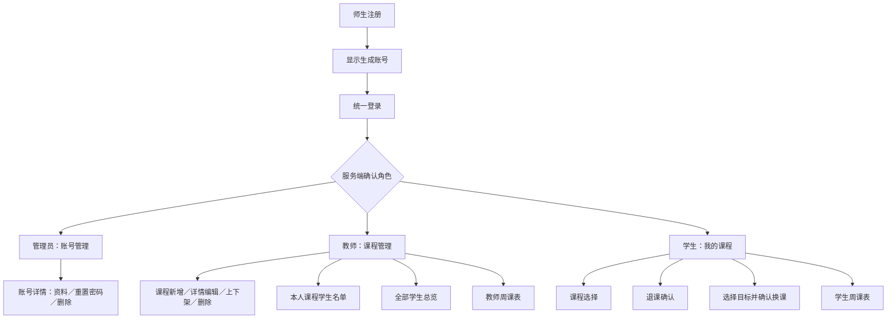
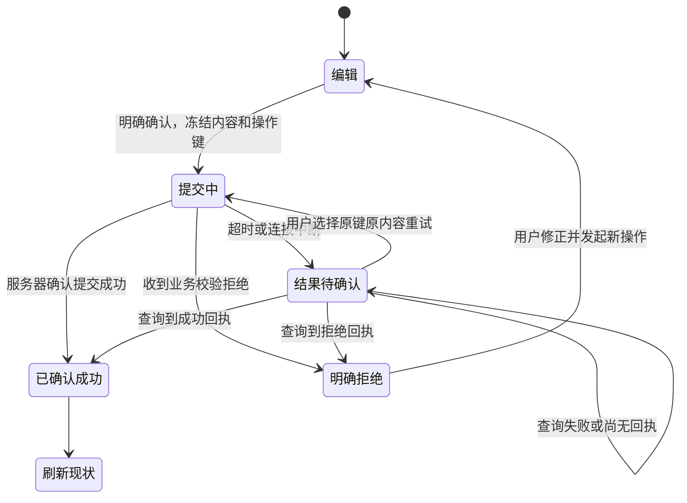

# 选课系统交互设计书

> 2026-09-06 环境状态补充：开发环境安装已执行，结果见 [P-02 环境记录](docs/verification/P-02.md)。本文交互契约和 P-03 视觉验证状态保持不变；“本轮不安装”等表述指本稿原始交付轮次。

> 版本：1.0.6  
> 日期：2026-09-04  
> 状态：交互设计文档已交付，完成静态规则及接口走查；实际页面、浏览器操作和视觉样张尚未验证。  
> 依据：[requirement.md](requirement.md) v1.0.6、[design.md](design.md) v1.0.6、[development-plan.md](development-plan.md) v1.0.6。  
> 职责：本文件是 P-03 的交互契约；技术接口、数据结构和事务以 design.md 为准，任务依赖与验收最终责任以 development-plan.md 为准。  
> 本轮生成 Markdown 交互设计，不创建业务工程、安装环境或执行迁移。

## 1. 设计摘要

管理员需要清楚知道账号变更会影响谁，教师需要在学期和课程状态约束下管理课程，学生需要在四门上限内可靠地选退换课。本设计采用统一导航、明确的学期上下文和一次操作一次结果的反馈方式，让用户在提交前知道对象和影响，在失败或超时后能够确认实际结果。

页面使用简体中文。桌面以表格和完整五日课表为主，窄屏以卡片、纵向表单和可横向滚动的五日课表呈现。保留五日布局会增加窄屏横向滚动，但不会把同一门课的两次安排或教师重叠课程隐藏掉。

## 2. 范围与现状

仓库尚无实际前端或后端；文中路由、页面和文案均为拟实现契约。低保真示意用于确定信息位置、操作顺序及状态，不代表已有可运行产品。

范围包括统一登录、自助师生注册、管理员账号新增查询编辑重置删除、学期切换、教师课程生命周期、两类学生查询、学生目录及选退换课、双端周课表。沿用用户确认的锁内学期判定、12 色可复用调色板、Java 21、MySQL 8.4、Docker Desktop 与 Testcontainers 路线。

本文件不重写 API，不增加账号恢复、教师身份审核、管理员代选、课程容量、导出、拖拽排课或自助改密码。管理员密码维护属于受限运维方式，无网页入口。

## 3. 页面上下文与导航



| 角色／公共区 | 页面与路由 | 主要入口与返回位置 |
| --- | --- | --- |
| 公共 | /login、/register | 登录、注册、注册成功结果；已登录访问时回本人首页 |
| 管理员 | /admin/accounts | 默认首页；角色筛选、搜索、分页、新增、详情 |
| 管理员 | /admin/accounts/new、/admin/accounts/[id] | 创建表单、资料编辑、独立重置密码、删除确认；返回原列表筛选页 |
| 教师 | /teacher/courses | 默认首页；课程添加、查看、学生名单、查看日历 |
| 教师 | /teacher/courses/new、/teacher/courses/[id] | 创建或管理本人课程；保存后回当前学期详情 |
| 教师 | /teacher/courses/[id]/students | 带课程头的分页名单；返回来源课程 |
| 教师 | /teacher/students | 全部学生的所选学期选课总览，完全只读 |
| 教师 | /teacher/timetable | 本人所有未删除课程的周课表 |
| 学生 | /student/courses | 默认首页；本人有效课程、X / 4、退课、换课、查看日历 |
| 学生 | /student/catalog | 已上架课程目录；详情使用同页抽屉，不新增接口 |
| 学生 | /student/timetable | 本人有效已选课程的周课表 |

全局页头显示系统名称、当前用户姓名、登录账号、角色及退出。教师侧栏为“课程查看／学生总览／周课表”，学生侧栏为“课程选择／课程查看／周课表”，管理员仅“账号管理”。移动端导航可折叠，按钮有可读名称并支持键盘。

课程、课表和两类教师学生查询页均显示学期选择器及起止日期；管理员账号管理属于跨学期账号资料，不放置会误导删除范围的学期筛选器。删除学生的影响明确涉及所有未结束学期。

## 4. 页面及主要交互

### 4.1 共用布局与低保真示意

桌面目标 1366×768：页头约 56px、侧栏约 200px、主区四周 24px；布局使用弹性宽度，不把这些尺寸作为固定设备限制。宽度不足 768px 时折叠导航，主区边距 16px，筛选器换行，表单单列。表格转带字段名称的卡片，不能只裁掉右侧操作列。

```text
桌面：教师课程页（示例数据）
┌ 选课系统                              张老师  t0000001  教师  [退出] ┐
│ 课程查看 │ 课程查看                       [添加课程] [查看日历]     │
│ 学生总览 │ 学期 [2026—2027 秋季 ▼]  2026-09-01～2026-11-23 进行中    │
│ 周课表   │ 编号   名称        状态    人数  完整周安排       操作     │
│          │ C001   课程甲      已上架  3     周一08:00-09:00  [详情]   │
│          │ C013   课程乙      已下架  1     周三14:00-15:00  [学生]   │
│          │ [上一页]  第1页 / 共N条  [下一页]                         │
└──────────┴─────────────────────────────────────────────────────────┘

窄屏 390×844：学生课程页
┌ [菜单] 选课系统                 [账户] ┐
│ 我的课程              本学期已选 4 / 4│
│ 学期 [2026—2027 秋季 ▼]              │
│ 2026-09-01～2026-11-23  进行中        │
│ [去选课]                 [查看日历]  │
│ ┌ C001-课程甲  [已下架，选课保留] ┐  │
│ │ 周一08:00～09:00               │  │
│ │ 周三14:00～15:00               │  │
│ │ [详情] [退课] [换课]           │  │
│ └───────────────────────────────┘  │
│ 下一个课程卡片……                    │
└────────────────────────────────────┘
```

列表搜索使用明确的“查询”按钮，回车等价提交查询，不在每次键入时请求。修改筛选后页码回到 1，默认每页 20、可选 20/50/100；总数及排序按后端结果显示。学生本人课程最多四门，页面获取完整列表。详情与对话框关闭后恢复来源列表的筛选、页码、滚动位置和焦点。

### 4.2 学期选择与页面生命周期

首次进入学期页面先获取 API-09，使用其 defaultSemesterId；主动选过有效学期后，同一用户在相关页面之间保持该学期。URL 中可带 semesterId，以便刷新或直达；非法或不存在的显式学期显示“学期不存在，请重新选择”，不静默对错误学期提交。退出清理用户学期状态，另一账号重新使用服务端默认值。

选择器按开课日期倒序，选项含“未开始／进行中／已结束”。页面始终显示起止日期；历史页置顶“本学期已结束，仅可查看”，空学期仍有日期、状态及空提示。未来、进行中均允许按规则操作，不额外设置选课窗口。

切换学期时先处理未保存表单，再关闭旧课程抽屉和未提交确认框、清空旧列表、重置页码并发起新查询；慢响应必须通过请求代次和学期检查后才能渲染。已发送的写请求不能因关闭页面或切换学期而宣称取消，结果继续绑定原操作及原学期。学期切换不把来源选课或目标课程带入新学期。

客户端显示的状态只供提示，最终以服务端 decisionTime 为准。结束前通过锁内判定、结束后提交成功的结果仍显示成功，然后刷新历史只读状态；排队后才判定已结束则显示拒绝。等待中不提前把按钮文案改为“操作失败”。

### 4.3 登录、注册与退出

登录表单为“登录账号、密码、登录”，下方“注册教师／学生账号”。账号输入去首尾空白，接受 admin 或小写 t/s 加七位数字；密码保持原样，不用注册的八字符规则拦截 admin 的初始密码。密码显示切换按钮有文字及可读名称，默认隐藏；不在页面公布其他用户凭据。

登录先准备匿名上下文 API-01，再提交 API-03；成功后按服务端 homePath 进入对应首页。错误统一“账号或密码错误”；不提示账号是否存在。已登录用户需先退出才能切换身份。访问受保护深链接时先 API-05 恢复身份，成功后只能恢复本角色允许的站内路径。

注册先选择教师／学生，表单依次为姓名、邮箱、密码、确认密码，不显示也不要求填写工号／学号。提交前校验全部字段，服务端字段错误映射到输入下方；输入修正不清空其他非密码内容。成功区域突出系统生成的工号／学号（即登录账号）及“复制账号／去登录”，不自动登录；复制失败时账号仍可选中手动复制。离开注册表单后清理密码，账号结果只在当前页面保留。

```text
注册
身份  (● 学生) (○ 教师)
姓名       [________________]
学号       [________________]
邮箱       [________________]
密码       [________________] [显示]
确认密码   [________________]
错误摘要：请检查邮箱及确认密码（仅出现错误时显示）
[注册]                     [返回登录]

成功
注册成功，请保存登录账号：s0000123
[复制账号] [去登录]
```

退出调用 API-04，成功后清空当前用户缓存和表单，回登录页。超时显示“退出结果待确认”，暂停受保护内容展示，可原操作重试或重新查询身份；不能仅删除界面状态就宣称服务器会话已注销。账号删除、重置密码或会话过期引起的 401，统一清理凭据相关页面状态，显示“会话已失效，请重新登录”。

### 4.4 管理员账号管理

账号列表默认全部师生，可按角色筛选及姓名、登录账号、注册编号查询；创建时间倒序，同时间按服务端内部标识稳定排序。字段为姓名、账号、角色、编号、邮箱、创建时间、详情。admin 不出现在可编辑账号列表。

新增表单复用注册字段和规则，成功展示账号，提供“查看详情／返回列表”。失败保持非密码字段。资料编辑中账号、角色和编号只读，姓名、邮箱可编辑；编辑请求不传工号/学号。资料与密码是两个独立提交区域，不显示一个会触发两次写入的“全部保存”按钮。

重置密码区域初始折叠，点击“重置密码”后填写新密码和确认密码；确认文案为“重置后，该账号所有已登录会话将失效”。不读取原密码。重置成功清空两个密码框并刷新版本；退出区域时也清理密码。

```text
账号详情：李同学  s0000123
角色：学生（只读）  账号：s0000123（只读）
姓名 [李同学]  学号 [S-123]  邮箱 [student@example.test]
[保存资料] [取消修改]
────────────────────────────────
[展开重置密码]  （独立提交，原密码不可查询）
────────────────────────────────
危险操作：[删除账号]

删除确认：李同学 / s0000123 / 学生
将取消该学生所有未结束学期的有效选课。
已结束学期的历史结果保留；账号不能再登录，唯一字段不再复用。
[取消] [确认删除]
```

删除前通过 API-12 获取当前版本和目标资料。学生确认框使用上述规则说明，不声称预先知道实时取消数量；实际成功后显示 API-15 返回的取消数量。教师确认框说明“若仍有未结束学期课程，将拒绝删除；历史课程归属保留”。拒绝时展示授权范围内的课程及学期处理摘要，管理员不能借此进入教师管理页面。无需新增删除预览 API。

删除按钮不默认获得焦点，Enter 不自动触发危险操作；按取消关闭不发送请求。资料被其他管理员会话改动时，旧版本删除被拒绝，必须重新读取并确认目标。成功回列表并移除账号；当前页变空且页码大于 1 时查询前一页。

### 4.5 教师课程创建和编辑

创建时，服务端比较教师本人同一学期全部未删除课程的授课安排。发生同星期时间重叠时，返回 `TEACHER_TIME_CONFLICT` 及冲突课程编号、名称和安排；新增课程弹窗保持打开，在表单顶部显示“请修改课程时间后重试”，并保留名称、描述和全部安排供用户继续修改。相邻的结束和开始时间不视为冲突。

创建页顶部固定所选学期及日期，名称、描述、第一条周安排必填；可“添加第二次授课”，最多两条，可移除第二条。每条使用星期、开始时间、结束时间三个带标签的选择框；星期仅周一至周五，时分仅半小时。午休不提供合法起点，跨午休组合显示字段错误，不静默更改结束时间。

名称去首尾空白后 1～100 个字符，描述 1～2000，显示字符计数并保留换行。周安排至少一次、最多两次且不同星期，每条完全处于 08:00～12:00 或 14:00～18:00。两次安排与主体一并提交；失败不丢失已填内容。

```text
添加课程
学期：2026—2027 秋季   2026-09-01～2026-11-23
名称 [__________________________________] 0 / 100
描述 [__________________________________]
     [__________________________________] 0 / 2000
第1次 [星期一 ▼] [08:00 ▼] 至 [09:00 ▼]
第2次 [星期三 ▼] [14:00 ▼] 至 [15:00 ▼] [移除]
[添加第二次授课]（已有两次时不显示）
提示：保存后为“未上架”，学生选课目录暂不可见。
[保存课程] [取消]
```

创建成功显示编号及“未上架”，进入详情，可独立点击“上架”。“保存课程”不自动发布。编辑复用表单，编号、所属学期和教师只读；有有效选课时仅课程名称和描述可改，安排显示只读及原因。提交仍包含原完整安排，不用隐藏字段或页面禁用替代服务端校验。刷新发现人数从 0 变为正数时停止安排编辑并提示重新核对，不把本地安排覆盖服务器。

### 4.6 教师课程状态与删除

列表显示编号、名称、状态、人数、每条完整周安排、详情及学生名单入口，详情显示描述和可用操作。以服务端 allowedActions 为操作依据；接口拒绝时刷新，不能绕过归属或历史只读。

| 状态／条件 | 展示 | 可用管理操作 |
| --- | --- | --- |
| 未上架、学期未结束 | 未上架；备课安排 | 编辑、上架；零有效选课时删除 |
| 已上架、学期未结束 | 已上架 | 编辑、下架；零有效选课时删除 |
| 已下架、学期未结束 | 已下架；已有选课保留 | 编辑、上架；零有效选课时删除 |
| 有有效选课 | 显示人数及名单入口 | 名称描述可改；时间只读，删除不可用并解释原因 |
| 学期已结束 | 历史只读 | 详情、名单、课表；无变更操作 |
| 已删除或不可访问 | 课程不可用 | 返回本人列表；没有恢复入口 |

上架／下架确认框显示编号、名称、学期和结果。下架明确“停止新选课，已有选课及课表保留”；上架明确进入学生目录。不提供“未上架→下架”。

删除确认显示课程和学期，说明从日常列表及课表移除、历史记录保留。人数为零的旧快照不能保证删除成功，服务端若返回 COURSE_HAS_STUDENTS 则保留课程并刷新人数。重复成功请求只显示已完成，不重复删除或生成新课程。

### 4.7 教师两类学生查询

本人课程名单从列表或详情进入，页头为“学期／编号／名称／有效人数”。列为姓名、学生登录账号、选课时间，按账号升序分页；空名单“暂无学生选择此课程”。下架课程保留名单；历史名单里的删除账号显示“账号已删除”，不剔除历史人数。其他教师课程专用名单返回无权限或不可见状态，不跳转到该课程管理详情。

学生总览始终包含所有未删除学生，按所选学期计算；筛选为全部、已选课、未选课，支持姓名或登录账号查询。另提供“我的全部课程／课程编号 - 课程名称”的下拉框，仅列出当前教师的课程；选择一门课程后仅显示已选择该课程的全部学生。每个学生显示姓名、登录账号、X / 4；可展开完整课程清单，每课含编号、名称、教师姓名、每次安排和发布状态。0 / 4 显示“未选课”；同名通过账号区分；下架但有效的课程仍计入。

```text
学生总览  学期 [2026—2027 秋季 ▼]  起止日期……
姓名或账号 [________] [查询]  选课 [全部 ▼]
[展开] 王同学  s0000001   0 / 4  未选课
[收起] 王同学  s0000002   2 / 4
        C001-课程甲  张老师  周一08:00～09:00   已上架
        C013-课程乙  李老师  周三14:00～15:00   已下架，选课保留
[上一页]  第1页 / 共N名学生  [下一页]
```

此页不显示邮箱、学号、密码、资料编辑或代选按钮。展开课程仅显示该页面获授权的字段，不调用其他教师课程专用详情 API。展开使用当前学生页响应中的完整课程数据，不为每个学生循环发送一次请求。

### 4.8 学生目录、已选列表与详情

目录按课程编号数字部分升序分页，显示编号、名称、所有安排、详情及“选课／已选”状态。详情抽屉补充描述、教师姓名、学期及状态；未选课程详情来自 API-26，已选课程详情来自 API-28，以支持下架后仍能查看。

已选页面显示“本学期已选 X / 4 门”，包含全部有效关系，下架课程保留并标注“已下架，已有选课保留”。空时显示“本学期尚未选课”和“去选课”。历史页面可看详情和周课表，不显示退课、换课入口。

选课点击一次提交整门课程及全部安排，不让用户勾选其中一次。未结束学期的目录可对新课程显示选课按钮，已满四门时按钮禁用并提示去“我的课程”换课；“已选”显示确认状态，不重新提交。客户端冲突提示只能作辅助，最后由服务端判断全部已选课程。

成功后重新查询当前学期计数、目录和已选列表，课表缓存失效；若提交成功但刷新失败，显示“选课已成功，列表刷新失败，可重试刷新”，不撤销成功提示或重发选课。数据未刷新时不能以旧计数继续提交。

### 4.9 退课与原子换课

退课先读来源有效关系和版本，确认框显示学期、编号、名称、所有安排，说明释放一个名额、若之后仍符合条件可重新选入；下架来源也允许退课。成功关闭确认框并刷新，失败保留来源；不得根据超时先在界面删除。

换课从“我的课程”的一门有效来源进入，固定来源及学期，打开同学期已上架目录选择目标；来源和其他已选课程不能作为正常目标，已选目标标明原因。即使已有四门也允许进入换课。仅展示来源与其余课程的实际时间信息，不将普通选课的“已满四门”限制套到换课。

```text
换课：2026—2027 秋季                 [关闭]
当前 4 / 4 门，换课成功后仍为 4 / 4 门
换出：C001-课程甲  周一08:00～09:00
换入：(○) C005-课程戊 周一08:00～09:00 [详情]
      (○) C006-课程己 周二10:00～11:00 [详情]
      C013-课程乙 [已选，不能换入]
选择后核对：
  将 C001-课程甲 换为 C005-课程戊。
  仅与换出课程重叠不构成冲突；还须与其余已选课程校验。
  失败时原课程保留。
[取消] [确认换课]
```

确认只发 API-31，不拆成退课和选课两个请求。来源版本及代次随同一操作提交，不能刷新后自动替换为最新代次继续执行旧意图。目标与其他课冲突时显示冲突课程及具体星期、时间，目标已下架/删除则刷新候选列表并保留来源；来源变化要求重新打开“我的课程”选择来源。

成功后刷新已选集合、计数、目录及课表，下次查询教师名单和总览应同步。来源等于目标的直接请求若返回 changed=false，界面显示“不需要换课”，不能宣称新增或减少课程。取消已发送请求只停止本地等待，不保证服务器回滚；待确认操作按第 7 节处理。

### 4.10 周课表与课程详情

周视图保持周一至周五，纵轴 08:00～18:00 的 20 个半小时格；12:00～14:00 四格标“午休”，不放课程。顶部显示学期、起止日期及“每周重复，仅在本学期起止日期内有效”。

```text
周课表  [2026—2027 秋季 ▼]  2026-09-01～2026-11-23
每周重复，仅在本学期起止日期内有效
时间    周一                   周二    周三              周四   周五
08:00   ┌C001-课程甲┬C013-课程乙┐
08:30   │ 同色实线 │ 同色虚线 │
09:00   └──────────┴──────────┘
……
12:00   午休                   午休    午休              午休   午休
12:30   午休                   午休    午休              午休   午休
13:00   午休                   午休    午休              午休   午休
13:30   午休                   午休    午休              午休   午休
14:00                                   ┌C001-课程甲┐
14:30                                   │第二次安排 │
15:00                                   └───────────┘
……
18:00   时间轴结束
```

每格 40px，位置和高度沿用技术设计公式；每条安排独立成块。教师所有未删除课程显示，标明未上架／已上架／已下架；未上架课程可注“备课安排”。学生只显示有效关系，退换出不显示，下架保留。

颜色及 borderStyle 直接使用 API，PALETTE_V1 色表及 slot 分配仅在 design.md 定义。此处不复制色值表，避免独立修改；第 1、13、37 门课程可能出现同色或同色同边框，仍以编号名称识别。状态文字不覆盖课程配色。

教师重叠按区间分组分列。为保证每个块可读，每个重叠列至少 120px；一天列宽至少为当天最大并列数×120px，整周总宽度随内容扩大并横向滚动。固定时间轴及星期头，窄屏提供“左右滑动查看完整周课表”的文字。保留完整五日及全部课程，不压到只剩无法访问的色条。该最小列宽是对既定并列布局的交互细化，需要同步进 design.md。

色块为可聚焦的详情入口，名称最多显示两行，截断时仍保留编号；鼠标点击、Enter/Space、触摸均可打开完整详情。不要依赖 hover tooltip 才能读全。窄屏抽屉占可视宽度，内容滚动但关闭按钮可访问；详情含完整名称、描述、所有安排、状态和学期。教师详情附本人管理入口，学生已选详情附合法退换课入口。

## 5. 必须遵守的不变量与字段规则

沿用 requirement.md 的 INV 编号，本文件不新增或重编号。

| 原不变量／需求 | 交互落实 |
| --- | --- |
| INV-01、INV-02、INV-10、INV-16 | 身份由服务端确认；导航隔离；教师名单字段受限；学生总览只读 |
| INV-03、INV-04、INV-08 | 课程主体与一至两条合法安排一次提交，全部成功后显示成功 |
| INV-05～INV-07 | 显示当期 X / 4；不跨学期计数；换课按最终集合；旧来源代次不能覆盖新选择 |
| INV-09、INV-11、INV-12 | 同页只呈现一个明确学期，历史只读，最终判断使用锁内 decisionTime |
| INV-13～INV-15 | 下架保留、删除条件明确、账号删除影响所有未结束学期并撤销会话 |
| REQ-25～30、REQ-51 | 稳定可复用配色、完整五日课表、同色重叠可读、详情可访问 |

注册及管理员新增复用需求第 4.1 节：姓名 1～50、编号 1～32 且限英文字母/数字/短横线/下划线、邮箱最长 254 且规范化小写、密码 8～64 且不全为空白、确认密码逐字符一致。字段长度按 Unicode 码点计数，与后端保持一致。编号区分大小写；邮箱和编号重复显示字段不可用，不展示占用者资料。

所有已存在对象更新使用服务端版本；重置密码单独校验新密码，登录允许 admin 初始密码的例外。课程安排按星期和开始时间排序展示。界面字符计数、必填标识和字段错误不能代替后端检查。

## 6. 接口与页面状态数据

### 6.1 全功能接口对应

API 编号、方法、字段和错误契约以 design.md 第 6 节为准，下表只定义页面使用位置。

| API | 页面用途 | 结果后的可见行为 |
| --- | --- | --- |
| API-01 | 注册登录前准备上下文 | 表单可提交；失败显示重试，不以空上下文提交 |
| API-02 | 注册 | 不填写工号／学号；显示系统生成的工号／学号（登录账号），不自动登录 |
| API-03 | 登录 | 进入服务端 homePath |
| API-04 | 退出 | 确认失效后回登录；超时转待确认 |
| API-05 | 页面刷新或深链接恢复身份 | 本角色页面或重新登录 |
| API-06 | 真实点击、提交及表单交互心跳 | 每 60 秒至多一次；后台查询不触发 |
| API-07 | 匿名注册／登录结果确认 | 仅原浏览器上下文可读 |
| API-08 | 已登录写操作结果确认 | 仅当前用户可读，读取后刷新相关视图 |
| API-09 | 所有学期页面 | 日期、状态、默认学期和可切换项 |
| API-10 | 管理员账号列表 | 角色／查询／分页结果 |
| API-11 | 管理员新增 | 显示生成账号及详情入口 |
| API-12 | 管理员详情及删除前复核 | 当前资料与 version |
| API-13 | 保存账号资料 | 刷新资料及版本 |
| API-14 | 重置密码 | 清空密码框、刷新版本、提示旧会话失效 |
| API-15 | 删除账号 | 学生取消数量或教师条件拒绝，列表刷新 |
| API-16 | 教师课程列表 | 当前学期、本人课程及人数 |
| API-17 | 保存新课程 | 新编号和未上架状态；与本人课程冲突时在当前弹窗提示并保留表单 |
| API-18 | 教师课程详情／编辑／确认前复核 | 全内容、人数、版本及 allowedActions |
| API-19 | 保存课程编辑 | 刷新详情、列表和课表 |
| API-20 | 上架／下架 | 状态刷新，已有选课保留 |
| API-21 | 删除课程 | 列表和教师课表移除 |
| API-22 | 本人课程学生名单 | 学生页和有效人数，历史删除标记 |
| API-23 | 全部学生总览 | 支持本人课程 courseId 筛选；学生页及完整课程数组，展开无逐学生请求 |
| API-24 | 教师周课表 | 全部未删除课程，无分页裁剪 |
| API-25 | 学生目录／换课候选 | 已上架课程页及本人已选标识 |
| API-26 | 未选目录课程详情 | 描述和完整安排；不暴露教师私有资料 |
| API-27 | 我的课程及计数 | 有效关系和当期 totalSelected |
| API-28 | 已选详情／退换前复核 | 下架也可读，来源 id/version/generation |
| API-29 | 选课 | 已选结果，重新查询计数 |
| API-30 | 退课 | 释放名额，重新查询现状 |
| API-31 | 原子换课 | 全部成功或来源保留；同源目标无变更 |
| API-32 | 学生周课表 | 当前学期全部有效课程 |

### 6.2 状态归属及数据保留

页面内存保存非密码表单草稿、打开的详情、选中的来源目标、查询页码及当前读请求代次。URL 仅存 semesterId、page、size 和课程等非秘密标识；账号搜索内容、邮箱、密码及完整表单不放入 URL。版本、代次、操作键为协议数据，不展示为用户必须理解的字段。

同一次已确认操作生成一次键并冻结请求内容；在途期间不能修改该请求对象。关闭确认框、切换页面不会改变已发送操作键。当前标签页的 sessionStorage 仅保留待确认操作的键、类型、目标内部标识、学期、所属用户标识和创建时间，不存密码、确认密码、Cookie、请求正文或个人资料快照；写入异常时提示“刷新后需重新查询实际结果”，不影响已经发送的操作。

待确认记录最多 20 条，达到上限时要求先确认已有操作，不静默丢弃最旧的未知结果。查询成功、明确拒绝或到期并确认现状后移除；退出或切换用户时清理。恢复时重新验证当前身份后才能查询本人记录；匿名结果依赖原 Cookie 上下文，不以存储的内部标识代替授权。

非密码草稿默认只存在当前页面内存。主动离开有修改的表单先提示“放弃未保存修改／继续编辑”；提交前取消不产生写入。刷新不承诺保留草稿。401 时仅在同一标签页内暂存非密码草稿，同一 userId 重新认证后先刷新对象及版本再允许手动恢复输入；切换账号则删除草稿，绝不自动重新提交。

## 7. 失败、超时与恢复

### 7.1 共用状态表

| 状态／错误 | 显示及保留内容 | 下一步 |
| --- | --- | --- |
| 加载中 | 骨架或“加载中”，表单相关提交不可用 | 完成本次读取；旧学期内容不继续充当新数据 |
| 空数据 | 学期和日期仍在，明确暂无课程／未选课／无匹配账号 | 按角色给添加课程、去选课或清除筛选入口 |
| 字段校验失败 | 顶部错误摘要及字段下错误，保留非密码字段 | 焦点转第一个错误，修正后新操作 |
| 401 会话失效 | 清理受保护数据及密码，说明需重新登录 | 同一身份恢复草稿前先读取最新数据 |
| 403 权限不足 | 拒绝说明及返回本人首页 | 不展示他人数据，不反复自动请求 |
| 404 资源不可用 | 保留返回入口，清除不可用对象选择 | 刷新所属列表；操作结果 404 单独按下一节处理 |
| VERSION_CONFLICT | “数据已更新，请刷新后重新确认”，保留非密码草稿在内存 | 手动刷新比较；新操作用最新版本，不自动覆盖 |
| MAX_COURSES_REACHED | “本学期最多选择四门课程” | 查看已选或发起换课 |
| TIME_CONFLICT | 具体课程编号、名称、星期及起止时间 | 修改目标，不删除已有选择 |
| TEACHER_TIME_CONFLICT | 冲突课程编号、名称、星期及起止时间；新增课程弹窗保留草稿 | 修改课程安排后在当前弹窗重新提交 |
| SEMESTER_CLOSED | “本学期已结束，无法执行此操作” | 刷新学期及只读状态 |
| COURSE_HAS_STUDENTS | 明确无法删除或修改安排 | 刷新人数及管理详情，不强制退课 |
| SOURCE_CHANGED | “来源选课已变化，请重新选择” | 关闭旧退换确认，刷新我的课程 |
| 429 | 显示限流提示及 Retry-After 倒计时 | 到期后由用户重试，不自动连续提交 |
| 503／网络中断／超时 | 读取错误给重试；写入显示结果待确认 | 先查操作结果，不能当作确定未提交 |
| 成功后读取失败 | “操作已成功，数据刷新失败” | 只重试读取，不重复写入 |
| DATA_INVARIANT_BROKEN | 明确课表数据异常及排查号 | 不隐藏冲突课程冒充正常，提供刷新及联系维护者文案 |

成功反馈在页面内可读，通知区域使用 aria-live。错误不只依靠颜色或短暂消息，关键拒绝常驻到用户处理或离开该页面。表单校验失败的密码仍只保存在当前输入控件内；认证失败、密码重置成功、离开表单或会话失效时清理。

### 7.2 待确认操作

写请求客户端等待上限设为 10 秒；超过后转“结果待确认”，本地停止等待不代表取消服务器事务。网络返回明确业务拒绝时显示该拒绝；无法可靠判断是否提交的响应先查询结果，不换键重做。



进入待确认后自动查询一次 API-07/08，随后只提供“查询结果／查看当前数据”，不持续后台轮询。查询按钮在请求中禁用；结果查询不触发活动心跳。对同一对象的变更暂时禁用，其他页面只读查看仍可用。用户主动确认重试时保留原键、版本、代次和正文，服务器负责重放保护。

查询返回 OPERATION_NOT_FOUND 不能证明最初请求不会稍后提交，仍保留待确认状态。原请求内容仍在内存时可原样重试；刷新后没有请求正文则先查看当前数据，不能仅用内部标识拼出一笔新写入。对注册／登录涉及密码的重试，原密码不持久化；必要时在原上下文重新输入同一内容确认，内容不同应使用新意图，但必须先处理旧结果，不能把同键冲突当成功。

成功回执只说明原操作发生过，不能覆盖后来变化；收到 replayed=true 后重新读取当前列表。410 表示结果详情已过期且旧键不能重做，提示查询当前状态后再决定新操作。登录回执不能直接替代 Cookie：先查询 API-05，若未建立可用会话则按技术设计重放有效的原登录操作；已失效则重新登录。

服务重启或数据库中断后仍使用原键查询。不能让“返回列表”按钮等价于“忽略未知结果并重新创建”。会话失效时先重新认证；换账号不允许读取前一个用户的结果。

### 7.3 在途操作与离开页面

提交前取消关闭确认框，不发请求；提交中关闭对话框只关闭展示，页面顶部保留待确认操作入口。切换学期可继续读取新学期，旧操作反馈始终显示原学期；不得把旧成功响应追加到新学期列表。

会话即将到期不依赖倒计时保证请求成功；任何 401 统一处理。真实点击导航、键入及确认提交可触发节流活动心跳，自动刷新、结果查询及定时器均不延长无操作期限。服务器不可用时提交禁用或转待确认，恢复后用户明确发起查询。

## 8. 可访问性、隐私与界面约束

所有输入有可见标签，必填不仅用星号表达；错误摘要中的项目可定位字段，输入通过 aria-describedby 关联错误。Tab 顺序按视觉阅读顺序；表单 Enter 只提交当前区域，独立密码区域不会同时保存资料。

对话框打开时焦点进入标题或安全取消按钮，焦点限制在对话框内，Esc 关闭后返回触发点；触发项被删除时返回列表标题。提交中的关闭仍遵循在途规则。日期、课程状态、已选数量、权限原因都有文本，不依靠图标含义猜测。

控制项触控目标至少 44×44px，文本可缩放；窄屏不出现无法触达的固定底部确认按钮。周课表色块本体若高度仅 20～40px，可点击并通过键盘进入，另在详情列表提供符合触控尺寸的入口，不人为拉高色块而破坏时间比例。动态加载时不不断抢焦点。

姓名、描述及全部错误文本按纯文本渲染；换行可保留，不执行用户 HTML。教师只能看到授权名单字段，不显示注册资料；账号查询中的个人字段不写进 URL 或前端日志。密码和 Cookie 不写 sessionStorage/localStorage，不因“恢复表单”而自动回填凭证。

使用简体中文文案和明确动作名，“删除账号”“确认换课”等必须说明对象。界面不暴露 Docker、数据库锁、HTTP 头等实现细节；异常排查号可展示供维护人员定位，不展示堆栈。

## 9. 验收映射

沿用原 AC 编号，不新增一套替代业务验收。后端一致性和真实浏览器证据依旧由原任务负责，本文提供页面观察点。

| 验收范围 | 对应章节和观察点 |
| --- | --- |
| AC-01～04、AC-22 | 4.3、4.4：注册生成账号、三角色跳转、admin 例外、退出及失效 |
| AC-05～08、AC-27～29 | 4.5、4.6：课程完整表单、安排限制、归属、生命周期及删除确认 |
| AC-09～14、AC-26 | 4.8、4.9：正确目录和本人列表、四门、冲突、跨学期隔离 |
| AC-15、AC-19 | 4.1、4.10：完整分页和课表、时间位置、稳定配色、同色重叠及详情 |
| AC-16、AC-18、AC-37 | 6.2、7：无假成功、失败保留、同键确认、版本与来源代次 |
| AC-17、AC-21 | 5、8：字段、脚本不执行、名单隐私、键盘与双视口 |
| AC-23、AC-24 | 4.4：资料及密码独立提交、删除影响、历史保留和会话失效 |
| AC-25、AC-36 | 4.2、7：84 天日期、未来／历史及锁内判定后的跨边界结果 |
| AC-30～33 | 4.9、7：退后重选、四门换课、来源下架、冲突及未知结果 |
| AC-34、AC-35 | 4.7：本人名单和全体学生边界、完整课程数组、重名和未选课 |
| AC-20、AC-38 | 环境与迁移属于 P-02/P-10；本稿不声称已证明，页面不能替代运行证据 |

## 10. 静态走查与后续验证

### 10.1 已完成的文档级走查

以下“已走查”仅指根据已写出的页面状态和接口契约逐步演算，不是实际点击页面或运行测试。

| 场景 | 预期路径与结论 | 本轮证据 |
| --- | --- | --- |
| 管理员建号、改资料、重置密码、删学生 | 4.4 → API-11/13/14/15；各自独立确认和提交，删学生说明所有未结束学期 | 文档已走查 |
| 教师新建后发布 | 4.5 保存 DRAFT → 4.6 独立上架；未发布不进入学生目录 | 文档已走查 |
| 四门时以同时间目标换课 | 来源 C001，其他三门无冲突，目标 C005 仅与来源重叠 → API-31；成功仍四门 | 文档已走查 |
| 换入与剩余课程冲突 | 服务端 TIME_CONFLICT，显示具体安排，来源保留 | 文档已走查 |
| 退课后重选，再收到旧退课回执 | 新关系代次，旧回执只确认旧操作，重新读取当前选择 | 文档已走查 |
| 全体学生中重名、未选课及其他教师课程 | 4.7 账号区分；0 / 4 明确；课程数组不按当前教师过滤 | 文档已走查 |
| 历史学期或下架已选 | 历史只读；下架在本人列表/课表保留，可按未结束规则退换 | 文档已走查 |
| 学期结束前判定后延迟提交 | 返回真实成功并刷新历史只读；排队后才判定结束则拒绝 | 文档已走查 |
| 结果查询先 404、随后成功 | 保留待确认，原键查询/重试，不发新键创建第二个对象 | 文档已走查 |
| 超过 12 门及第 1/13/37 门同色 | 稳定色/边框允许复用，编号名称保留，重叠分列可滚动 | 布局和规则已演算，视觉样张未验证 |

### 10.2 P-03 及实现阶段待保留的证据

P-03 仍需在可视化低保真样张上核对普通、灰度及色觉差异模拟下的可读性，尤其是 13 门和 37 门教师课程、同色同边框相邻及重叠。文字示意已经提供流程和布局依据，但不能宣称颜色差异或窄列可读性已被实际验证。

实际前端完成后，按 P-04～P-20 在 Chrome、Edge 的验收时稳定版运行对应流程，记录确切浏览器版本、1366×768 与 390×844 截图。键盘覆盖导航、字段、对话框、课表详情、错误定位与关闭返回；触摸覆盖完整名称和横向课表。P-10 汇总性能及恢复证据，不能以静态示意替代。

P-02 与 P-03 汇合检查本文件第 6 节与 design.md 的 32 个接口一致、确认对象/学期/版本一致、同键和代次语义一致。本文明确的课表最小重叠列宽、待确认记录与等待机制需同步技术设计；不得只在前端私自实现另一套协议。

## 11. 风险与取舍

固定 12 色与边框组合可重复，因此课程编号名称必须持续可读；这符合已确认的复用规则，但不能把颜色当唯一检索方式。教师大量同时重叠会形成较宽课表，以横向滚动保留全部课程；将其压缩至一屏会破坏可读性，不采用。

未知结果会暂时限制同一对象继续变更，减少重复创建和旧请求误操作；用户可查询结果及当前数据，不需要重启页面。跨设备或其他会话仍可能修改同一对象，版本和来源代次由服务端保护，前端禁用不是并发保证。

非密码草稿仅内存保留，刷新可能丢失未保存输入；这是避免浏览器长期存储个人资料的取舍。待确认键只用于原身份下查询，无法重建密码请求正文，也不能作为登录凭据。

## 12. 未决项与交付状态

用户已选择独立 interaction-design.md。本文件不再提出需要重新选择的业务默认项；六项已确认选择是锁内学期判定、12 色复用、Java 21、独立 MySQL 8.4、Docker Desktop/Testcontainers、独立交互文档。

| 工作 | 当前状态 | 完成责任 |
| --- | --- | --- |
| 本交互文档、页面和低保真文字示意 | 已交付，静态接口与主要路径走查完成 | P-03 |
| 可视化样张、灰度及色觉差异模拟 | 未执行，不伪称 P-03 全部完成 | P-03 |
| 精确依赖、JDK/Docker/MySQL 安装及隔离兼容验证 | 已确定路线，尚未完成 | P-02 |
| 实际浏览器、键盘、性能及业务验收 | 无业务工程，尚未执行 | 对应实现任务及 P-10 |

开发准入继续遵守计划：完成剩余 P-02/P-03 交付再进入 P-04。上述剩余项是已明确的执行和验证工作，不需要重新询问已采纳的选项。后续如本机不满足 Docker 官方条件，记录具体事实并提出最小解决方案，不把选择方案视为环境已经可用。

## 13. 范围排除与修订

不提供额外管理员管理、角色切换、真实身份认证、课程容量/候补、跨学期换课、批量代操作、月历、导出、拖拽、品牌设计或实际部署。本轮不安装开发环境、不执行测试脚本、不修改真实账号或数据库。

| 版本 | 日期 | 变更 |
| --- | --- | --- |
| 1.0.6 | 2026-09-04 | 用户选择独立交互文档；完成页面、低保真示意、32 个接口映射、异常状态及静态走查，保留未执行验证的真实状态 |
